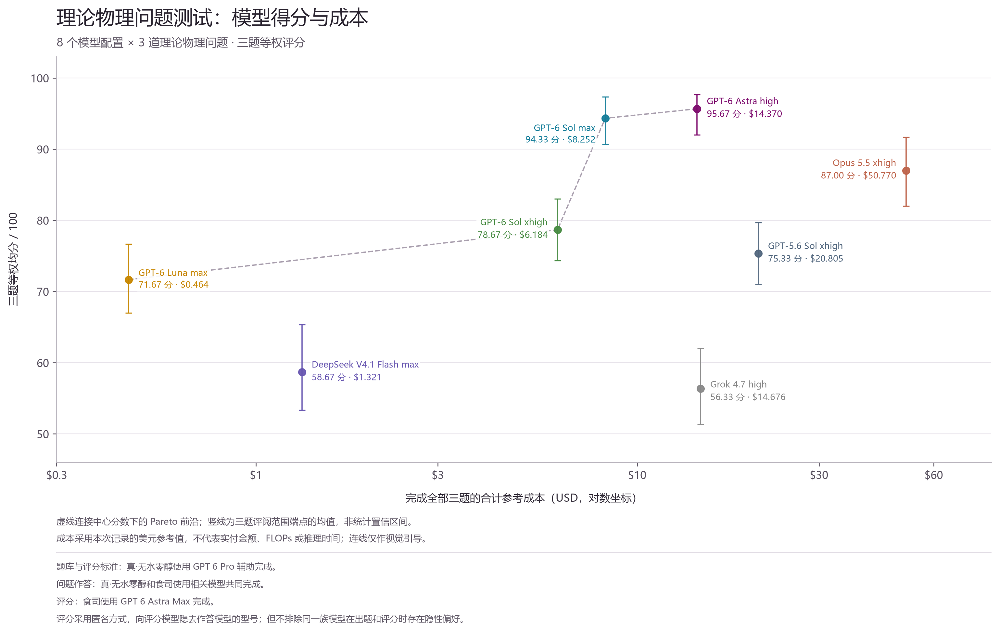

# 理论物理与数学物理 AI 研究任务评测 v1

本项目由 **[真·无水零醇](https://github.com/Zhen-WushuiLingchun)** 与 **[食司](https://github.com/Manontel)** 共同完成。我们选取三道理论物理与数学物理研究问题，记录模型的最终答卷、匿名评分、核验依据和美元参考成本，观察它们在复杂科研任务中的表现。

当前完整数据包含 **8 个模型配置 × 3 道题，共 24 项采用结果**，评分日期为 2026-09-23，资料整理于 2026-09-24。这是一次探索性评测，反映本次材料和工作方式下的表现；任务数量、交互条件和成本口径应与具体结论一起阅读。

## 项目参与与评分方式

- **题库与评分标准**：真·无水零醇使用 **GPT 6 Pro** 辅助完成。
- **问题作答**：真·无水零醇和食司使用相关模型共同完成。
- **评分**：食司使用 **GPT 6 Astra Max** 完成。

评分阶段采用匿名编号，向评分模型隐去作答模型的型号，评分完成后再合并模型身份与成本。但不排除同一族模型在出题和评分时存在隐性偏好。评阅记录包含解析、符号与数值抽查；这些检查不构成统一的第三方独立审计。[补充评分记录](evaluations/supplement/补充评分明细.json)保留了辅助评阅接触潜在 PDF 元数据身份线索的具体说明，便于检查匿名过程的边界。

## 从哪里开始

| 内容 | 入口 |
| --- | --- |
| 完整题库与评分细则 | [三道题](questions/math_physics_ai_benchmark_questions.md) · [评分细则](questions/math_physics_ai_benchmark_rubric.md) |
| 全部三题的最终评分表 | [Excel 工作簿](results/模型评分与成本汇总.xlsx) · [24 项 CSV](data/scores.csv) · [完整 JSON](data/analysis_data.json) |
| 逐题、逐模型与成本分析 | [完整分析报告](results/analysis.md) |
| 最终结论图片 | [对数坐标 PNG](results/figures/结果对数版.png) · [线性坐标 PNG](results/figures/结果线性版.png) · [对数 SVG](results/figures/结果对数版.svg) · [线性 SVG](results/figures/结果线性版.svg) |
| 采用的答卷与匿名编号 | [答卷索引](submissions/README.md) · [全部 PDF 的 SHA-256 清单](data/submissions.json) |
| 分项评分与核验证据 | [评阅记录索引](evaluations/README.md) |
| 模型作答工程与源码 | [作答工程索引](runs/README.md) |
| 用量与参考成本来源 | [成本口径](costs/README.md) · [脱敏用量报告](costs/usage_reports/README.md) |
| 数据检查与复现 | [脚本说明](scripts/README.md) |

## 三题结果

第 1 题是 [YM→EYM 一圈重构](questions/01_YM_EYM_one_loop.md)，第 2 题是 [Fibonacci 信息恢复](questions/02_Fibonacci_information_recovery.md)，第 3 题是 [黑洞振铃与谱稳定性](questions/03_Ringdown_spectral_stability.md)。每题 100 分，三题等权；高分要求核心结果可核验，不要求完成所有开放研究层。

| 排名 | 模型配置 | 题 1 | 题 2 | 题 3 | 总分 /300 | 均分 /100 | 三题参考成本 USD |
| --- | --- | ---: | ---: | ---: | ---: | ---: | ---: |
| 1 | GPT-6 Astra high | 92 | 97 | 98 | 287 | 95.67 | 14.370 |
| 2 | GPT-6 Sol max | 94 | 94 | 95 | 283 | 94.33 | 8.252 |
| 3 | Opus 5.5 xhigh | 87 | 93 | 81 | 261 | 87.00 | 50.770 |
| 4 | GPT-6 Sol xhigh | 54 | 92 | 90 | 236 | 78.67 | 6.184 |
| 5 | GPT-5.6 Sol xhigh | 57 | 87 | 82 | 226 | 75.33 | 20.805 |
| 6 | GPT-6 Luna max | 53 | 86 | 76 | 215 | 71.67 | 0.464 |
| 7 | DeepSeek V4.1 Flash max | 47 | 75 | 54 | 176 | 58.67 | 1.321 |
| 8 | Grok 4.7 high | 30 | 69 | 70 | 169 | 56.33 | 14.676 |

GPT-6 Sol max 在第 1 题最高，GPT-6 Astra high 在第 2、3 题最高。三题等权下，Astra 的总分高 4 分；Sol max 的参考成本低约 42.6%。Luna max 的三题参考成本最低，但第 1 题核心证书存在错误，不能仅用分数除以美元来替代对研究结果的判断。



[线性坐标版本](results/figures/结果线性版.png)使用同一组分数与成本。竖线是三题评阅范围端点的均值，**不是统计置信区间**；虚线连接中心分数下的离散 Pareto 前沿，只帮助阅读，不表示连续增加算力的性能规律。

## 评分、版本与成本口径

五维评分为：定义与题设审计 **15**、已知／低阶校准 **30**、独立验证 **15**、研究推进 **30**、结论校准与可继续性 **10**。评阅者新增的计算用于检查答卷，不计为作答模型自行完成的贡献。具体页码、正确结果、错误依赖和后续工作见 [evaluations](evaluations/README.md)。

仓库保留 **27 份匿名答卷 PDF**：原批次 19 份，补充批次 8 份。最终统计采用 24 份，Opus 5.5 xhigh 的三题采用 `s_1a`、`s_2a`、`s_3a` 的评分，并按提供者指定沿用原费用，各计一次。其余五份补充回答补齐缺测项。不同题目的相同字母不表示同一模型；以[明确映射](submissions/README.md)为准。

表中金额沿用参与者提供的三位小数记录，24 项合计 **116.842 USD**。其中部分记录来自 token 用量按当时 API 单价换算，Grok 的部分记录来自会话账本；**不能统一解释为订阅账户的实际付款**。现有用量报告并未覆盖全部 24 项记录，缺少日志的部分以提供者给出的数值为准，不补造 token 或计费细节。历史高精度参考表的覆盖范围与舍入方式也不完全相同，详见[成本说明](costs/README.md)。

本次每个配置每题只有一个采用结果，任务选择和评分本身均有限制。上下文、工具权限、交互轮次和修正机会没有充分证据证明严格统一；题面协议是参考要求，不能直接视为所有运行都满足。小分差不代表统计显著的能力差异，结果不能外推成跨领域的普遍排名，也不能从美元金额推断 FLOPs 或推理时间。

## 目录与复现

```text
questions/     三道题、合并题库与评分细则
runs/          已公开的模型作答工程、TeX、计算脚本与小型结果
submissions/   两批匿名 PDF；索引标明最终采用版本
evaluations/  分项评分、逐题评语与评阅者核验记录
costs/         历史成本表与脱敏用量说明
data/          最终机读数据、身份映射、原始表和答卷哈希
results/       完整工作簿、分析报告和结论图
scripts/       数据检查、绘图、报告及工作簿生成脚本
```

从仓库根目录检查数据和原始答卷的一致性：

```bash
python scripts/check_dataset.py
```

安装绘图依赖并重绘对数／线性结论图：

```bash
python -m pip install -r scripts/requirements.txt
python scripts/plots.py --conclusion-only
```

中文绘图需要微软雅黑、Noto Sans CJK SC 等字体，也可用 `BENCHMARK_FONT` 指定字体文件。各模型原始科学计算的依赖和适用范围不同，见 [runs](runs/README.md)；数据一致性检查不会替代对这些研究结论的数学证明。

仓库保留答卷、评分证据、可编辑源文件与用于生成汇总的代码。环境依赖目录、页面渲染缓存、临时数组、原始会话日志和第三方论文 PDF 留在本地；文档链接和机读路径均按仓库结构整理。
