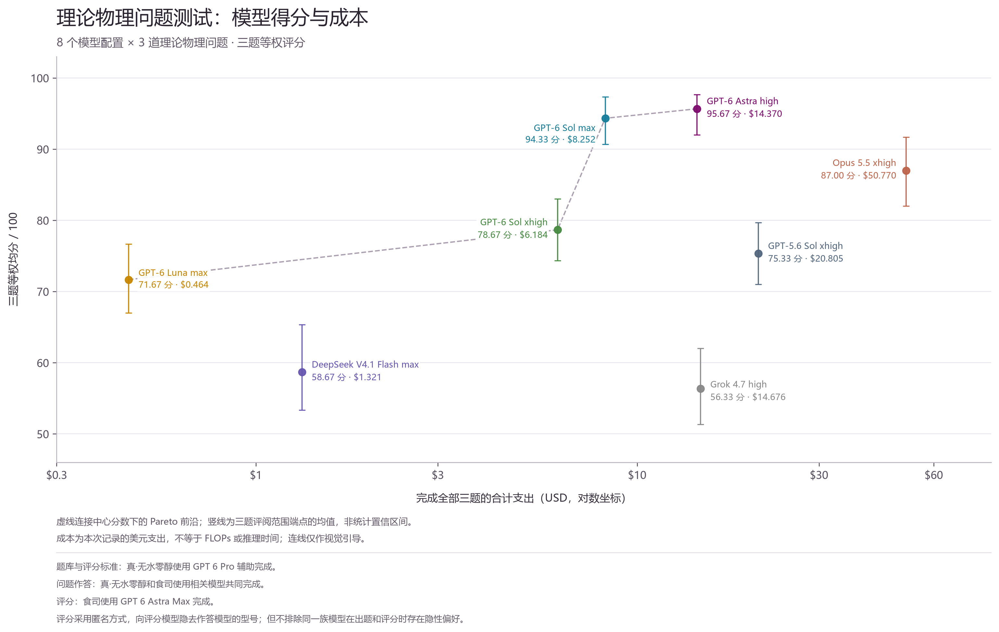

# 数学物理 AI 任务试验（v1）

这是一次**探索性尝试**，不是经过严格控制、校准和独立复核的模型基准测试。它把较长的数学物理研究问题交给不同模型，在允许查资料、写代码、反复检查和修正的工作方式下，观察答案质量、耗用的 token 和参考成本。设计目标是**粗略模拟日常使用这些模型解决复杂问题时的感受**，而不是给出具有统计意义的能力排名。

## 从哪里开始

| 内容 | 文件 |
| --- | --- |
| 完整题库（三道题） | [题库](math_physics_ai_benchmark_questions.md) |
| 单题题面 | [01：YM→EYM 一圈重构](01_YM_EYM_one_loop.md) · [02：Fibonacci 信息恢复](02_Fibonacci_information_recovery.md) · [03：黑洞振铃谱稳定性](03_Ringdown_spectral_stability.md) |
| 预设评分维度与核验点 | [评分说明](math_physics_ai_benchmark_rubric.md) |
| 用量与 API 单价换算 | [参考成本表](token_cost_01_02_03.md) · [脱敏用量报告](usage_reports/README.md) |
| 结果概览 | [对数坐标图](结果对数版.png) · [线性坐标图](结果线性版.png) |



图上的点、误差棒和虚线用于帮助阅读这次记录。误差棒是评阅范围的示意，**不是统计置信区间**；虚线也不表示经过严格验证的优势关系。

## 问题与材料

三题分别涉及振幅重构、受融合约束的信息恢复，以及黑洞准正规模与可观测波形。题面要求区分证明、精确低阶检验、数值证据和未解决部分。每个模型目录保留了选定的报告、可编辑的 TeX、交付 PDF，以及与结论有关的计算代码和小型结果文件。

| 图中的模型配置 | 本仓库保留的题目 | 主要目录 |
| --- | --- | --- |
| GPT-6 Astra high | 01 | [gpt_test_6_astra](gpt_test_6_astra/solution/README.md) |
| GPT-6 Sol xhigh | 01–03 | [gpt_6_sol](gpt_6_sol/) |
| GPT-5.6 Sol xhigh | 01–03 | [gpt_test2_5.6sol](gpt_test2_5.6sol/) |
| Grok 4.7 high | 01–03 | [grok_test_4.7](grok_test_4.7/) |
| Claude Opus 5.5 xhigh | 01–03 | [01](opus5.5_test/q1/) · [02](opus5.5_test_2/) · [03](opus5.5_test_3/) |
| DeepSeek V4.1 Flash max | 01–03 | [01](ds_flash_test/test1/) · [02](ds_flash_test2/report/) · [03](ds_flash_test3/) |
| GPT-6 Luna max | 01 | [luna_test](luna_test/) |
| GPT-6 Sol max | 01 | [Sol_max_test](Sol_max_test/) |

目录名沿用实验时的名称。**部分配置只有题 01 的公开材料**；图中的三题汇总分数没有随附完整的逐题评分表，因此不能仅凭本仓库独立复算或公平比较全部图上点位。阅读具体研究结论时，请以各份报告写明的适用范围和复算材料为准。

## 如何理解结果

- 题目数量少，任务选择本身带有作者偏好。题库、作答和评阅过程都使用了 AI 辅助；即使评阅时隐去模型名，也可能存在模型家族偏好。
- 公开记录不足以证明上下文、工具权限、交互轮次、时间预算、修正机会与计算环境得到严格统一。评分说明中的协议是理想化参考，不能视为所有记录都满足的实验控制条件。
- 图示分数是这次评阅的主观总结，不能外推为模型的普遍数学物理能力。报告中出现的证明和计算也未经统一的第三方独立审计。
- [参考成本表](token_cost_01_02_03.md)按当时记录的 token 用量和标准 API 价格换算，**不是订阅账单或实际付款**。图示横轴与该表的覆盖范围、统计口径并不完全相同，不宜将两者逐项对账。价格、模型版本和服务模式变化后，数值也会失效。

因此，这个仓库更适合用来查看模型面对复杂任务时的工作过程、答案边界和个人使用体验，不适合作为采购、学术评价或正式排行榜的唯一依据。

## 公开范围与复现

仓库按文件白名单发布。缓存、编译日志、原始会话导出、会话标识、含个人目录的本机路径、大型临时数值数组、重复打包文件和第三方论文 PDF 没有上传；用量报告为去除本机路径和会话标识的公开副本。保留的代码和 TeX 主要用于追踪各份答案的计算过程，依赖项因目录而异，也未统一锁定版本。

例如，题 01 的一份精确检查可在安装 Python、SymPy 后从仓库根目录运行：

```powershell
python gpt_test_6_astra/solution/checks/verify_q1.py
```

对应目录的 [复现说明](gpt_test_6_astra/solution/README.md)给出该报告自己的检查范围和 XeLaTeX 构建方法。其他报告中的数值检查、低阶证书和一般性推断应分别看待。
