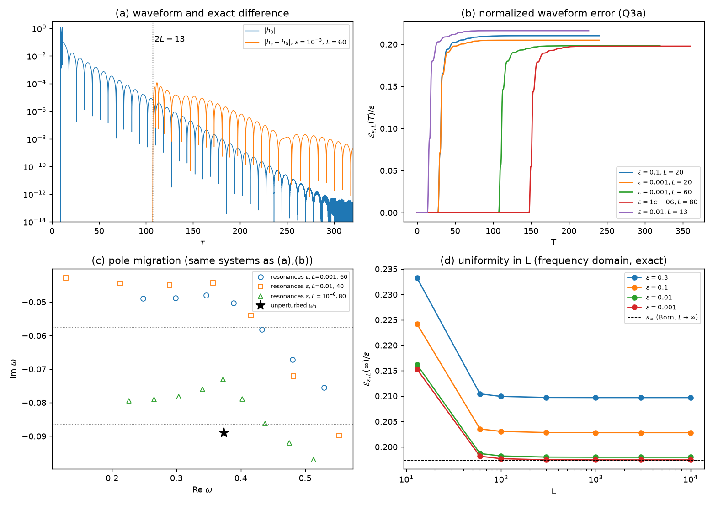

# 题三解答：Regge–Wheeler ℓ=2 远区小势垒——极点谱不稳定 vs. 观测波形稳定

> 所有数值均由本目录 `q3_work/` 中的代码实际运行得到（无 `NOT_RUN` 项）。
> 标记约定：
> **【已证明】** 完整证明；**【证明概要】** 标准论证、关键步骤给出但未逐条写满；
> **【已证明｜条件 J】** 在明确列出的标准散射论假设 J 下严格成立，常数为数值计算值（非区间认证）；
> **【精确低阶】** 精确的低阶/静态解析计算；**【数值】** 仅有数值证据；**【猜想】** 猜想或未闭合步骤。

---

## 0. 结论摘要

1. **因果（A）【已证明】**：对任意 ε、任意 L>12，$h_{\varepsilon,L}(\tau)=h_0(\tau)$ 对 $0\le\tau\le 2L-13$ 精确成立，且 $2L-13$ 是最优（之后任意小区间内 $h_\varepsilon-h_0\not\equiv0$，但在该点无穷阶平坦）。两个信号在 $[0,9]$ 上都恒为 0，故 (Q3b) 在 $T\le 9$ 无定义。
2. **阶数（A）**：$T>2L-13$ 时 $\mathcal E(T)=\varepsilon\,c_1(T)+O(\varepsilon^2)$，$c_1>0$（generic 一阶）；$\mathcal M(T)=\varepsilon^2 m_2(T)+O(\varepsilon^3)$（一阶项恒等抵消），且有精确不等式 $\mathcal M(T)\le \|h_\varepsilon-h_0\|_T^2/\|h_0\|_T^2$。数值（ε→0，L≥13）：$\mathcal E(\infty)/\varepsilon\in[0.1974,0.2152]$，$\mathcal M(\infty)/\varepsilon^2\in[0.0196,0.0234]$。
3. **极点（B）**：精确共振方程 $A_{\rm in}(\omega)=\beta(\omega)A_{\rm out}(\omega)$；一阶位移 $\delta\omega^{(1)}=\varepsilon\kappa(L)$，$|\kappa(L)|\simeq 0.1488\,e^{2\gamma_0L}$（$\gamma_0=0.08896$）。**真正的展开参数是 $\Lambda=2L|\delta\omega^{(1)}|$，不是 $|\delta\omega^{(1)}|$**；重求和为 $\omega=\omega_0+\tfrac{i}{2L}W_k(-2iL\delta\omega^{(1)})$（Lambert-W；k=0 为连续接到 $\omega_0$ 的主模，k≠0 为空腔模；主模的 ε 幂级数收敛当且仅当 $\Lambda<1/e$），主模误差比一阶公式小 1–2 个量级（Λ 到 35 仍有效）。在 $L=c\log(1/\varepsilon)$ 双重极限下：$c<c_*=1/(2\gamma_0)=5.620$ 时基模位移 $\sim\varepsilon^{1-2\gamma_0c}\to0$；$c>c_*$ 时没有共振收敛到 $\omega_0$，最低阻尼共振迁移到 $\operatorname{Im}\omega\to-1/(2c)$ 的新分支（间距 π/L），位移不随 ε 消失。
4. **统一稳定性（C）**：
   * **【已证明】（初等能量法，全参数）** $\mathcal E(T)\le 1.053\,\varepsilon\,[(T+2-L)^4-(L-11)^4]_+^{1/2}$。在 $T=O(L)$、$L=c\log(1/\varepsilon)$ 窗口给出 $\mathcal E\le C\varepsilon\log^2(1/\varepsilon)$（对数因子来自估计工具）。
   * **【已证明｜条件 J】（源–探测器 resolvent 界，对所有 T 一致）** 只要 $\varepsilon K_3(L)<1$（数值 $K_3(L)\approx0.41L$），就有 $\sup_T\mathcal E\le \varepsilon K_2N_L/[(1-\varepsilon K_3)\|h_0\|]$，常数与 T、L 无关。它覆盖所有 $L=c\log(1/\varepsilon)$（任意 $c>0$，ε 足够小），也就覆盖了极点已经迁移 O(1) 的全部 $c>c_*$ 情形。
   * **【数值】+【猜想】** 对全部 $L\ge L_0$ 一致成立：精确频域计算到 $L=10^4$、$\varepsilon=0.3$（$\varepsilon L=3000$）时 $\mathcal E(\infty)/\varepsilon$ 随 L 单调下降并收敛到 $\kappa_\infty(\varepsilon)=0.1974+O(\varepsilon)$。唯一未闭合的是一个低频引理 (LF)（§4.6）。
   * **最佳幂次 α=1【已证明】**；无对数修正（在 $\varepsilon K_3(L)<1$ 内【已证明｜条件 J】，其余【数值】）。$L_0=13$ 时 $C_*\approx0.2152+0.09\varepsilon$（ε≤0.3 时 ≤0.2333）【数值】。
5. **相容性判据**：精确表示 $\delta\hat\psi(\omega,x_o)=-\varepsilon\langle D_L,(1+\varepsilon K_L)^{-1}S_L\rangle$（源、势垒、探测器三段截断 resolvent）。**极点位移由 $K_L(\omega)$ 在下半平面的大小决定（$\sim e^{2L|\operatorname{Im}\omega|}$），(Q3a) 只由 $K_L,D_L,S_L$ 在实轴上的大小决定（有界）。所以大的谱位移与 (Q3c) 完全相容。** 真正不稳定的是相对/指数加权的晚期量：回波时刻的逐点相对误差 $=(0.16\text{–}0.59)\,\varepsilon e^{2\gamma_0L}$（ε=1e−3、L=60 时为 17.5，而同一信号 $\mathcal E=2\times10^{-4}$）——它与极点位移受同一个参数控制。

*图：(a) ε=1e-3、L=60 时 $|h_0|$ 与 $|h_\varepsilon-h_0|$（后者在 τ<107 严格为 0）；(b) $\mathcal E(T)/\varepsilon$；(c) 同一系统的扰动共振（最低阻尼模 Im ω≈−0.048，而 $\omega_0$ 处 Im=−0.0890）；(d) $\mathcal E(\infty)/\varepsilon$ 对 L 直到 $10^4$。*

---

## 1. 设定、记号与精确频域表示

### 1.1 基本量（均已数值核验）

* $\rho(x)=2\bigl(1+W_0(e^{x/2-1})\bigr)$（$W_0$ 为 Lambert 函数）；$\rho(0)=2.5569$，$\rho(10)=7.8525$。$V_0>0$ 于全轴，峰值在 $x=2.389$（$\rho=3.2808$），$V_{\max}=0.151287$。$V_\varepsilon=V_0+\varepsilon W_L\ge0$（ε>0），$W_L:=W(\cdot-L)$，$B_L:=[L-1,L+1]$。
* $C=0.5692357678$；$\|W\|_1=1.2069003$，$\|W\|_2=0.9916556$；$\partial_\tau\psi_0$ 的守恒能量 $E_1=26.12052$。
* $\|h_0\|^2_{L^2(0,\infty)}=1.006733$（频域 Plancherel）/ $1.006738$（时域两分辨率 Richardson）。其中 97.8% 来自 prompt 脉冲 $\tau\in[9,11.5]$，1.0% 来自 $[13,40]$ 的 ringdown，$\tau>40$ 仅 $2\times10^{-5}$。
* Leaver 连分式：$\omega_0=0.3736716844-0.0889623157i$，$\omega_1=0.3467109969-0.2739148753i$，$\omega_2=0.3010534546-0.4782769832i$。复路径积分得到的 $|A_{\rm in}|$ 在 $\omega_{0,1}$ 处 $<5\times10^{-13}$，其零点与 Leaver 值相差 $<10^{-13}$。

### 1.2 Jost 解与共振
约定 $e^{-i\omega\tau}$，Laplace 变换 $\hat f(\omega)=\int_0^\infty e^{i\omega\tau}f\,d\tau$（Im ω>0）。$(-\partial_x^2+V-\omega^2)\hat\psi=S_\omega:=-C(W'+i\omega W)$。
$\psi_-\sim e^{-i\omega x}$（$x\to-\infty$），$\psi_+\sim e^{i\omega x}$（$x\to+\infty$），$\tilde\psi_+(\omega,\cdot):=\psi_+(-\omega,\cdot)$（实 ω 时等于 $\overline{\psi_+}$）。
$\psi_-=A_{\rm out}\psi_++A_{\rm in}\tilde\psi_+$，$\mathcal W_0:=\mathcal W(\psi_-,\psi_+)=2i\omega A_{\rm in}$，$G_0(\omega;x,y)=-\psi_-(x_<)\psi_+(x_>)/\mathcal W_0$。QNM ⟺ $A_{\rm in}(\omega)=0$（下半平面）。
令 $R:=A_{\rm out}/A_{\rm in}$，$\phi_R:=\psi_-/A_{\rm in}$（右入射单位振幅散射态），$I(\omega)=\int\psi_-S_\omega$，$\mathcal A(\omega):=-I/(2i\omega A_{\rm in})$（出射振幅）。于是 $\hat\psi_0(\omega,x_o)=\mathcal A\,\psi_+(x_o)$，$\hat h=-i\omega\hat\psi(x_o)$（因 $\psi(0,x_o)=0$）。

### 1.3 势垒的精确处理与"回波公式"【已证明】
势垒左侧 $\psi_+^\varepsilon=a\psi_++b\tilde\psi_+$（右侧 $\psi^\varepsilon_+=\psi_+$）。由 $\frac{d}{dx}\mathcal W(f,g)=\varepsilon W_Lfg$（f 解未扰动方程、g 解扰动方程）得精确恒等式
$$
b=\frac{\varepsilon}{2i\omega}\int W_L\psi_+\psi_+^\varepsilon,\qquad a=1-\frac{\varepsilon}{2i\omega}\int W_L\tilde\psi_+\psi_+^\varepsilon,\qquad
\mathcal W_\varepsilon:=\mathcal W(\psi_-,\psi^\varepsilon_+)=2i\omega(aA_{\rm in}-bA_{\rm out})=\mathcal W_0-\varepsilon\!\int\! W_L\psi_-\psi^\varepsilon_+ .
$$
由于 $\psi_-$ 与源都在势垒左侧，$\psi_-$ 不变，直接代数运算给出（$\beta:=b/a$）
$$
\boxed{\;\hat\psi_\varepsilon(\omega,x_o)-\hat\psi_0(\omega,x_o)=\mathcal A(\omega)\,\phi_R(\omega,x_o)\,\frac{\beta(\omega)}{1-\beta(\omega)R(\omega)}
=\mathcal A\,\phi_R\,\frac{b}{a-bR}\;}
$$
物理意义：出射波 $\mathcal A$ 被小势垒以"反射系数"β 反射、在 BH 势与小势垒之间多次反弹（$\sum_k(\beta R)^{k-1}$），再以 $\phi_R$ 透射到观察者。实 ω 时通量守恒给出 $|a|^2-|b|^2=1$，故 $|\beta|<1$，$|R|\le1$。
**共振**（$\mathcal W_\varepsilon=0$）⟺ $F(\omega):=A_{\rm in}(\omega)-\beta(\omega)A_{\rm out}(\omega)=0$。
Born 项：$\hat h_1=-i\omega\mathcal A\phi_R\,b_1$，$b_1=\frac1{2i\omega}\int W_L\psi_+^2$；大 L 时 $\psi_+=e^{i\omega x}(1+\tfrac{3i}{\omega\rho}+O(\rho^{-2}))$，$b_1\approx e^{2i\omega L}\hat W(-2\omega)/(2i\omega)$。
（数值核验：频域 $\hat h_0,\hat h_1$ 与时域波形的数值 Laplace 变换在 ω=0.05…3 相对吻合到 $\lesssim10^{-5}$；§5。）

### 1.4 等价的 Birman–Schwinger / 源–势垒–探测器形式【已证明】
令 $K_L(\omega)=W_L^{1/2}R_0(\omega)W_L^{1/2}$（势垒→势垒），$D_L(\omega)=W_L^{1/2}G_0(\omega;\cdot,x_o)$（势垒→探测器），$S_L(\omega)=W_L^{1/2}R_0(\omega)S_\omega=W_L^{1/2}\hat\psi_0$（源→势垒）。由 $R_\varepsilon=R_0-\varepsilon R_0W_LR_\varepsilon$：
$$
\boxed{\;\delta\hat\psi(\omega,x_o)=-\varepsilon\,\big\langle D_L(\omega),\,(1+\varepsilon K_L(\omega))^{-1}S_L(\omega)\big\rangle\;}\quad(\text{双线性配对}).
$$
它在闭上半平面成立，并亚纯延拓到下半平面，**其极点正是共振（$1+\varepsilon K_L$ 不可逆处）**。这是本题"源+探测器 resolvent"判据的核心公式（§4.5）。

### 1.5 Plancherel 与 $\sup_T$【已证明】
$\mathcal E(T)$ 对 T 单调不减，故 $\sup_T\mathcal E(T)=\mathcal E(\infty)$，且（h 为实信号）
$$\mathcal E(\infty)^2=\frac{1}{\pi\|h_0\|^2}\int_0^\infty|\hat h_\varepsilon(\omega)-\hat h_0(\omega)|^2d\omega .$$
严格化：ψ 至多多项式增长（能量守恒 + 有限传播速度），对 Im ω=η>0 用 Plancherel，再令 η↓0（单调收敛）。

---

## 2. A 部分：因果传播与首阶波形

### 定理 1（因果）【已证明】
对任意 L>12 与任意 ε：(i) $h_\varepsilon\equiv h_0\equiv0$ 于 $[0,9]$；(ii) $h_\varepsilon(\tau)=h_0(\tau)$ 对一切 $0\le\tau\le2L-13$。

*证明.* $\Box+V$（V 有界光滑）有单位传播速度（截断光锥上的能量估计）。$\operatorname{supp}\psi_0(\tau,\cdot)\subset[-1-\tau,1+\tau]$，$x_o=10$ 在 τ<9 时不在其中，得 (i)。$u:=\psi_\varepsilon-\psi_0$ 满足 $(\Box+V_\varepsilon)u=F:=-\varepsilon W_L\psi_0$，零初值；$\operatorname{supp}F\subset\{(s,y):y\in B_L,\ y\le1+s\}$。若 $u(\tau,x_o)\ne0$，须存在 $(s,y)\in\operatorname{supp}F$ 使 $\tau-s\ge y-x_o$，从而 $\tau\ge s+y-10\ge(y-1)+y-10\ge2(L-1)-11=2L-13$。所以 $u(\cdot,x_o)\equiv0$ 于 $[0,2L-13]$，其 τ-导数 $h_\varepsilon-h_0$ 亦然。∎

### 命题 2（最优性与平坦性）【证明概要】
对任意 ε>0 与 δ>0，$h_\varepsilon-h_0\not\equiv0$ 于 $(\tau_*,\tau_*+\delta)$（$\tau_*=2L-13$），但它在 $\tau_*$ 处所有导数为 0。
*概要.* 1+1 维 $\Box+V$ 的推迟基本解为 $\tfrac12\theta(t-s-|x-y|)\,\mathcal R(t,x;s,y)$，Riemann 函数 $\mathcal R$ 连续且在光锥边界上 $\equiv1$。对 $\psi_0$ 用同一表示：在右波前 $y-s\uparrow1$ 附近，$\psi_0=CW(y-s)\,(1+O(\eta^2))$，因为势修正正比于 $\int_{1-\eta}^1W\ll W(1-\eta)$（W 在端点无穷阶平坦）。于是在角点 $(s,y)=(L-2,L-1)$ 的小邻域内 $W_L\psi_0>0$，而对 $\tau=\tau_*+\delta$，$u(\tau,x_o)=-\tfrac{\varepsilon}{2}\iint_{D_\delta}\mathcal R_\varepsilon W_L\psi_0<0$（$D_\delta$ 为非空开集，$\mathcal R_\varepsilon=1+O(\delta)$）。若 $\dot u(\cdot,x_o)\equiv0$ 于该区间，u 将恒为 $u(\tau_*)=0$，矛盾。平坦性来自 W 与 $\psi_0$ 波前的无穷阶平坦。对 Born 项 $u_1$ 同理，因此 $h_1\not\equiv0$ 于 $(\tau_*,\tau_*+\delta)$。
【数值】离散格式（Courant 数 1 的 GPP 菱形格式，数值光锥与物理光锥精确一致）中，$u(\cdot,x_o)$ 在 $\tau<2L-13+2h$ **按位严格为 0**，9 组 (ε,L) 在 h=1/128、1/256 下都如此（起始 = 2L−13+2h → 2L−13）；紧随其后的值极小（例如 L=60、ε=1e−3 时 $\mathcal E(\tau_*+1)=3.5\times10^{-6}$，$\mathcal E(\tau_*+2)=3.8\times10^{-5}$），与无穷阶平坦一致。

### 2.1 Duhamel / Born 展开与余项
$u=\varepsilon u_1+\varepsilon^2u_2$，$u_1=-\mathcal G_0[W_L\psi_0]$，$u_2=-\mathcal G_\varepsilon[W_Lu_1]$（$\mathcal G_V$ 为 $\Box+V$ 的推迟解算子），即
$$
h_\varepsilon-h_0=\varepsilon h_1+\varepsilon^2 r_\varepsilon,\qquad h_1(\tau)=-\partial_\tau\!\int_0^\tau\!\!\int G^{\rm ret}_0(\tau-s;x_o,y)\,W(y-L)\,\psi_0(s,y)\,dy\,ds .
$$
频域：$\hat h_1=i\omega\,\psi_-(x_o)I\,\mathcal W_0^{-2}\int W_L\psi_+^2$（= §1.3 的 $-i\omega\mathcal A\phi_Rb_1$）。

余项控制（三种互补的范围）：
* **(R1)【已证明】全部 ε>0、L>12、T**（初等能量法，见定理 A 的证明）：
  $\|h_\varepsilon-h_0-\varepsilon h_1\|_{L^2(0,T)}\le 0.2641\,\varepsilon^2\,[\sigma_T^7-\sigma_*^7]_+^{1/2}$，$\sigma_T=T+2-L$，$\sigma_*=L-11$（常数 $=\|W\|_2^2E_1^{1/4}\sqrt{8/567}$）。
* **(R2)【已证明｜条件 J】对所有 T 一致**：若 $\varepsilon K_3(L)<1$，则 $\|h_\varepsilon-h_0-\varepsilon h_1\|_{L^2(0,\infty)}\le\varepsilon^2K_2K_3(L)N_L/(1-\varepsilon K_3(L))$（证明同定理 B，把 Neumann 级数多展一项）。
* **(R3)【数值】** $(\mathcal E(\infty)/\varepsilon-\|h_1\|/\|h_0\|)/\varepsilon\approx0.054$–$0.10$（表 C1），即实际二阶修正远小于 (R2) 的 $O(\varepsilon L)$ 悲观估计。

### 2.2 (Q3a)(Q3b) 的阶数：generic、特殊抵消、归一化失效
| 时间范围 | $\mathcal E(T)$ | $\mathcal M(T)$ |
|---|---|---|
| $T\le9$ | 0（精确） | **归一化失效**：$\|h_0\|_T=\|h_\varepsilon\|_T=0$，无定义 |
| $9<T\le2L-13$ | 0（精确，所有阶） | 0（精确，所有阶） |
| $T>2L-13$ | **generic 一阶**：$\varepsilon c_1(T)+O(\varepsilon^2)$，$c_1=\|h_1\|_T/\|h_0\|>0$，在 $\tau_*$ 处无穷阶平坦 | **特殊抵消**：一阶项恒为 0（$\mathcal M$ 只依赖夹角，$\delta h$ 平行于 $h_0$ 的分量不贡献）；$\mathcal M=\varepsilon^2m_2(T)+O(\varepsilon^3)$，$m_2=\|P_\perp h_1\|_T^2/(2\|h_0\|_T^2)>0$ |

【已证明】$m_2>0$：若 $h_1=\lambda h_0$ 于 $[0,T]$，由于 $h_1\equiv0$ 于 $[0,\tau_*]$ 而 $h_0\not\equiv0$ 于 $(9,\tau_*)$，得 λ=0，与命题 2 矛盾。
【已证明】对实信号的精确界：$\mathcal M(T)=1-|\cos\theta|\le\sin^2\theta\le\|h_\varepsilon-h_0\|_T^2/\|h_0\|_T^2=\mathcal E(T)^2\,\|h_0\|^2_\infty/\|h_0\|^2_T$。
**注意 (Q3a) 用的是 $h_0$ 的总能量归一化**，prompt 脉冲占 97.8%，所以在 $\tau\approx2L$ 处"回波/已衰减背景"的巨大比值不会进入 $\mathcal E$（§3.5）。

【数值】时域（GPP，h=1/256；括号内为 Born 预测 $m_2$）：

| ε | L | $\mathcal E(\infty)/\varepsilon$ | $\mathcal E(\tau_*+5)$ | $\mathcal M(T_{\max})/\varepsilon^2$ ($m_2$) |
|---|---|---|---|---|
| 1e−1 | 20 | 0.210139 | 1.39e−2 | 0.02207 (0.02096) |
| 1e−2 | 20 | 0.205375 | 1.36e−3 | 0.02109 (0.02096) |
| 1e−3 | 20 | 0.204818 | 1.36e−4 | 0.02098 (0.02096) |
| 1e−2 | 13 | 0.216145 | 1.39e−3 | 0.02336 (0.02315) |
| 1e−3 | 30 | 0.200582 | 1.33e−4 | 0.02012 (0.02011) |
| 1e−2 | 40 | 0.199687 | 1.32e−3 | 0.01994 (0.01982) |
| 1e−4 | 50 | 0.198442 | 1.31e−5 | 0.01969 (0.01969) |
| 1e−3 | 60 | 0.198155 | 1.30e−4 | 0.01964 (0.01962) |
| 1e−6 | 80 | 0.197765 | 1.30e−7 | 0.01965 (0.01956) |

（ε=1e−6 时 $\mathcal M\sim10^{-14}$，接近双精度舍入；$\tau<\tau_*$ 处出现的 $\mathcal M\approx-2\times10^{-16}$ 为舍入误差。）

---

## 3. B 部分：同一系统的极点迁移

### 3.1 一阶位移【已证明（一阶微扰）】【数值】
在简单根 $\omega_0$ 处，$F(\omega_0+\delta)=A'_{\rm in}\delta-\beta A_{\rm out}+\dots$，得
$$
\delta\omega^{(1)}=\varepsilon\,\frac{b_1(\omega_0)A_{\rm out}(\omega_0)}{A'_{\rm in}(\omega_0)}=\frac{\varepsilon\int W_L\psi_-\psi_+}{\partial_\omega\mathcal W_0(\omega_0)}=:\varepsilon\kappa(L),\qquad
\kappa(L)\simeq\frac{A_{\rm out}\hat W(-2\omega_0)}{2i\omega_0A'_{\rm in}}\,e^{2i\omega_0L}\,(1+O(L^{-1})).
$$
数值：$A_{\rm out}(\omega_0)=-1.029204+0.057780i$，$A'_{\rm in}(\omega_0)=-10.438806-0.197380i$，$\hat W(-2\omega_0)=1.157180+0.024636i$，$|\kappa_\infty|=0.14875$。

| L | 13 | 20 | 30 | 40 | 60 | 100 |
|---|---|---|---|---|---|---|
| $|\kappa(L)|$ | 1.241 | 4.480 | 27.64 | 167.9 | 6061 | 7.651e6 |
| $|\kappa|e^{-2\gamma_0L}$ | 0.1228 | 0.1276 | 0.1329 | 0.1362 | 0.1400 | 0.1434 → 0.1488 |

第一泛音 $\omega_1$：$|\kappa_1|e^{-2\gamma_1L}$ 从 0.127（L=13）增长到 0.249（L=100），增长率 $e^{2\gamma_1L}$，$\gamma_1=0.2739$。
**适用条件**：$\Lambda\ll1$（见下）且 $|\delta\omega^{(1)}|\ll$ 与其它根的距离。

### 3.2 真正的展开参数与重求和【证明概要】【数值】
在 $\omega_0$ 的固定小圆盘内写 $\beta(\omega)=\varepsilon e^{2i\omega L}B(\omega;\varepsilon,L)$，其中 B 对 $L\ge L_0$、$\varepsilon\le\varepsilon_0$ 一致有界解析（$\psi_+e^{-i\omega x}$ 在 $B_L$ 上一致有界，$a=1+O(\varepsilon)$）。于是零点满足
$$
\delta=\delta^{(1)}e^{2iL\delta}\bigl(1+O(\delta)\bigr)\ \Longrightarrow\ \delta_k=\frac{i}{2L}W_k\!\left(-2iL\,\delta^{(1)}\right)\bigl(1+O(\delta)\bigr),
$$
$W_k$ 为 Lambert 函数的各分支。$k=0$ 分支连续接到 $\omega_0$；在模型方程（略去 $O(\delta)$ 修正）中，对固定 L，它的 ε 幂级数就是 $W_0(z)$ 的 Taylor 级数，**收敛当且仅当 $\Lambda:=2L|\delta\omega^{(1)}|<1/e$**（$z=-1/e$ 处 $W_0$ 与 $W_{-1}$ 碰撞，对应主模与一个空腔模的例外点）。因此控制微扰展开的是 $\Lambda\approx0.30\,L\varepsilon e^{2\gamma_0L}$，而不是 $|\delta\omega^{(1)}|$：大 L 时即使 $|\delta\omega^{(1)}|\ll1$，线性化也可能已经失效。$k\ne0$ 分支是 BH 势垒与小势垒之间的"空腔模"，间距 ≈π/L。

精确根（复 Jost 函数 + Muller 迭代，$|F|/|A_{\rm out}|<10^{-9}$）对比：

| ε | L | Λ | 一阶 $\omega_0+\delta^{(1)}$ | Lambert-W (k=0) | 精确根 | 一阶误差 | LW 误差 |
|---|---|---|---|---|---|---|---|
| 1e−3 | 20 | 0.179 | 0.37207−0.08478i | 0.37246−0.08529i | 0.37260−0.08525i | 7.1e−4 | 1.4e−4 |
| 1e−6 | 60 | 0.727 | 0.37955−0.09045i | 0.37842−0.08738i | 0.37825−0.08750i | 3.2e−3 | 2.1e−4 |
| 1e−5 | 50 | 1.01 | 0.37563−0.09888i | 0.38583−0.09093i | 0.38473−0.09112i | 1.2e−2 | 1.1e−3 |
| 1e−3 | 30 | 1.66 | 0.34775−0.07935i | 0.36473−0.07789i | 0.36580−0.07721i | 1.8e−2 | 1.3e−3 |
| 1e−6 | 70 | 5.07 | 0.39622−0.06062i | 0.37643−0.07960i | 0.37672−0.07996i | 2.8e−2 | 4.7e−4 |
| 1e−4 | 50 | 10.1 | 0.39323−0.18819i | 0.39362−0.07477i | 0.39334−0.07690i | 1.1e−1 | 2.1e−3 |
| 1e−8 | 100 | 15.3 | 0.34966−0.16160i | 0.36378−0.08018i | 0.36429−0.07986i | 8.3e−2 | 6.0e−4 |
| 1e−6 | 80 | 34.6 | 0.27280**+0.10198i** | 0.37148−0.07281i | 0.37228−0.07307i | 2.0e−1 | 8.5e−4 |

最后一行说明：线性外推甚至给出错误的"增长模"（Im>0），而重求和与精确根一致。空腔分支（ε=1e−6、L=80，k=−4…4）：精确根 Re ω=0.227…0.513，相邻间距 0.030–0.039（π/80=0.0393），Im ω 在 −0.073…−0.097；Lambert-W 对 k≠0 的预测误差 ≤0.012（离主分支越远，O(δ) 修正越大）。

### 3.3 双重极限 $L=c\log(1/\varepsilon)$【已证明｜条件 J-asym】【数值】
**命题 B3.** 设 $L=c\log(1/\varepsilon)$，ε→0。
(a) 若 $\gamma_n<1/(2c)$，恰有一个共振收敛到 $\omega_n$，且 $|\omega-\omega_n|\sim|\kappa_{\infty,n}|\,\varepsilon^{1-2\gamma_nc}\to0$；
(b) 若 $\gamma_n>1/(2c)$ 且 $B_\infty A_{\rm out}(\omega_n)\ne0$（n=0 时数值上 $A_{\rm out}(\omega_0)=-1.029+0.058i$，$\hat W(-2\omega_0)=1.157+0.025i$），没有共振收敛到 $\omega_n$；在任一紧集 $K\subset\{\operatorname{Im}\omega>-1/(2c)\}$ 内共振只收敛到那些 $\gamma_n<1/(2c)$ 的 $\omega_n$，而共振以密度 $L/\pi$ 聚集到直线 $\operatorname{Im}\omega=-1/(2c)$（**新分支**），$\operatorname{Im}\omega_k=-\frac{1}{2L}\log\frac{1}{\varepsilon|B R|}+o(L^{-1})$；
(c) 在 $\{\operatorname{Im}\omega<-1/(2c)\}$ 的紧集内，共振收敛到 $B_\infty(\omega)A_{\rm out}(\omega)$ 的零点（$B_\infty=\hat W(-2\omega)/(2i\omega)$）。
*证明.* 在 K 上 $|\varepsilon e^{2i\omega L}|=\varepsilon^{1+2c\operatorname{Im}\omega}$。上方区域中 $\beta A_{\rm out}\to0$ 一致成立，对 $F$ 用 Hurwitz 定理；下方区域中 $A_{\rm in}/(\varepsilon e^{2i\omega L})\to0$，对 $F/(\varepsilon e^{2i\omega L})$ 用 Hurwitz 定理。所需输入 (J-asym)：$B(\omega;\varepsilon,L)\to B_\infty(\omega)$ 在紧集上一致成立，这由 $\psi_\pm$ 的一致渐近展开给出（本文用的正是这个展开，并做了数值核验）。(a) 中的速率来自 §3.2。∎（(c) 没有做数值检验。）
**阈值**：基模 $c_*=1/(2\gamma_0)=5.6203$；第一泛音 $c_{1*}=1/(2\gamma_1)=1.8254$。$c=c_*$ 时 $\Lambda\sim2L|\kappa_\infty|\to\infty$ 缓慢增长，位移按 $O(\log L/L)$ 趋零。

数值（沿 k=0 分支追踪的精确根）：

| c | ε=1e−2 | 1e−3 | 1e−4 | 1e−6 | 1e−8 | 1e−10 | 预测极限 |
|---|---|---|---|---|---|---|---|
| 3 | 0.35291−0.09673i | 0.37075−0.08552i | 0.37441−0.08750i | 0.37371−0.08918i | 0.37365−0.08895i | 0.37367−0.08896i | $\omega_0$，速率 $\varepsilon^{0.466}$ |
| 4 | 0.38254−0.07424i | 0.37736−0.07967i | 0.37424−0.08304i | 0.37216−0.08737i | 0.37299−0.08925i | 0.37369−0.08916i | $\omega_0$，速率 $\varepsilon^{0.288}$ |
| 5 | 0.34599−0.06716i | 0.38840−0.07548i | 0.37205−0.07540i | 0.37932−0.08124i | 0.38322−0.08617i | 0.37039−0.08528i | $\omega_0$，极慢 $\varepsilon^{0.110}$ |
| 6.5 | 0.36499−0.05505i | 0.37929−0.06129i | 0.38702−0.06534i | 0.36813−0.06695i | 0.37884−0.06937i | 0.36810−0.07033i | Im→−0.0769 |
| 8 | 0.37876−0.04886i | 0.36977−0.05169i | 0.36424−0.05371i | 0.38243−0.05699i | 0.37328−0.05779i | 0.36747−0.05853i | Im→−0.0625 |

c=3 时 $|\omega-\omega_0|$ 从 1e−6 到 1e−10 缩小 72 倍（对应指数 0.46，预测 0.466）。c=8 时向 −1/(2c) 的收敛带 $O(\log L/L)$ 修正：Lambert 渐近 $\operatorname{Im}\delta\approx(\log\Lambda-\log\log\Lambda)/(2L)$ 给出 ε=1e−10 时 −0.0588，精确值 −0.0585。

### 3.4 与同一 (ε,L) 时域信号的比较【已证明】+【数值】
取 **(ε,L)=(1e−3,60)**（c=8.69>c_*，Λ=727）。扰动系统的最低阻尼共振为 0.34592−0.04795i、0.29867−0.04873i、0.38873−0.05023i、…（图 (c)），阻尼比 $\gamma_0$ 小约 46%。**辐角原理**（圆周 240 点，最大相位步长 0.19 rad）确认 $|\omega-\omega_0|<0.035$ 内共振个数为 0（ε=1e−6、L=80 时半径 0.012 内也为 0）。然而：
* **因果**：$h_\varepsilon\equiv h_0$ 于 $[0,107]$（定理 1）。在窗口 [82,106] 对 $h_\varepsilon$ 做单模自由拟合，得 **0.373672−0.088962i**（相对残差 7e−7），也就是**未扰动的** $\omega_0$。ε=1e−4、L=50 时同样得到 0.373675−0.088962i。
* **pole residues**：$\operatorname{Res}_{\omega_0}\hat h_0=0.046927+0.014382i$，预测时域振幅 $-i\operatorname{Res}=0.014382-0.046927i$（$h_0\supset2\operatorname{Re}[-i\operatorname{Res}\,e^{-i\omega_0\tau}]$）；在 [25,70] 上用 $\omega_0,\omega_1$ 最小二乘得 0.014342−0.046922i（相对偏差 3e−3，来自泛音/尾巴污染）。
* **回波**：$\tau>107$ 时 $\delta h$ 是 prompt 脉冲的 O(ε) 反射（峰值 ≈0.12ε），加上它自己的 ringdown。由回波公式，$\mathcal A\phi_R\beta$ 含 $A_{\rm in}^{-2}$，即在**未扰动** $\omega_n$ 处是二阶极点。数值上，在 $[\tau_*+30,\tau_*+80]$ 用"$\omega_0,\omega_1$ 且带 $\tau e^{-i\omega\tau}$ 久期项"拟合，相对残差为 3e−4；单个简单极点 $\omega_0$ 的残差为 47%（ε=1e−2/L=40、1e−4/L=50、1e−6/L=80 结果相同）。**扰动后的新谱不直接出现在任何有限时间窗中。**
* **相对误差 vs 能量归一化误差**：回波窗口 $(\tau_*,\tau_*+25)$ 内 $\max|\delta h|/\max|h_0|=17.5$（$\varepsilon e^{2\gamma_0L}=43$），而 $\mathcal E(\infty)=1.98\times10^{-4}$，$\mathcal M(\infty)=1.96\times10^{-8}$。九组数据中该比值 $=(0.16\text{–}0.59)\,\varepsilon e^{2\gamma_0L}$（系数随窗口内 ringdown 的相位变化）：**控制极点位移的参数恰好控制回波时刻的相对波形误差，而不是 (Q3a)。**
* **新共振的 residue 与适用时间窗【精确低阶】**：在空腔零点 $\omega_k$ 处 $\frac{\beta}{1-\beta R}$ 的留数 ≈$\frac{i}{2L\,R(\omega_k)}$，所以每个新模的激发系数是 $O(1/L)$，**不随 ε 变小**。但 $e^{-i\omega_k\tau}$ 的"起效"时间是 $\tau\gtrsim2L$，此时 $|e^{-i\omega_k\tau}|\approx e^{-\log(1/\varepsilon)}=\varepsilon$；约 L 个这样的模叠加出 O(ε) 的回波。因此在 $\tau<2L-13$ 上，有限个扰动 QNM 之和不能代表 $h_\varepsilon$（那里 $h_\varepsilon=h_0$，由未扰动 $\omega_0$ 主导）。正确的时间窗表述是回波展开：$\delta\hat\psi=\mathcal A\phi_R\sum_{k\ge1}\beta^kR^{k-1}$，第 k 项幅度 $O(\varepsilon^k)$，到达时间约 $2kL$；在 $[0,2(k+1)L-13)$ 内只有前 k 项起作用，每一项的 ringdown 都由**未扰动** $\omega_n$ 的 (k+1) 阶极点给出。
* **prompt response**：$\|h_0\|^2$ 的 97.8% 来自 prompt 脉冲，它经小势垒反射后成为回波的主体。回波谱权重集中在 $\omega\in[0.3,1.9]$（90% 分位 1.32，99% 分位 1.87）。
* **branch cut / tail**：未扰动尾巴 $h_0\sim\tau^{-8}$ 对 $\|h_0\|^2$ 的贡献可以忽略。在双精度时域中无法分辨（τ≳280 时噪声底 ~1e−13；我们尝试测量 τ∈[800,1600] 的尾巴比值，结果被舍入噪声淹没，**不作任何数值声称**）。【精确低阶/静态】穿过势垒的静态正则解 $u_0=\rho^3/8$ 在势垒外侧的 $\rho^3$ 系数变为 $A=\tfrac18+\varepsilon\int W_Lu_0v_0\approx\tfrac18(1+\varepsilon\|W\|_1\rho_L/5)$，由此【猜想】晚期尾巴振幅按 $(8A)^{-2}$ 缩放（L=20、ε=0.1 时静态积分给出 $8A=1.444$），即尾巴振幅有 $O(\varepsilon\rho_L)$ 的**相对**改变，但对 $\mathcal E$ 的贡献 $\lesssim\varepsilon^2L^2\int_{2L}^\infty\tau^{-16}$。低频分支切割附近还有另一个现象：在 Jost 基下 $|\beta(\omega)|\to1$（数值上 ω~1e−3 时 $|\beta|>1-10^{-9}$），空腔增强因子 $|1/(1-\beta R)|$ 可达 $10^5$，但这些频率对 $\mathcal E^2$ 的贡献 $\le2\times10^{-9}$（§4.4）。

---

## 4. C 部分：统一观测稳定性

### 4.1 定理 A（初等能量界，全参数）【已证明】
对一切 ε>0、L>12、T≥0：
$$
\mathcal E_{\varepsilon,L}(T)\le K_A\,\varepsilon\,\bigl[(T+2-L)^4-(L-11)^4\bigr]_+^{1/2},\qquad K_A=\tfrac{\sqrt2}{3}\|W\|_2E_1^{1/4}/\|h_0\|=1.0533 .
$$
*证明.* (i) $V_\varepsilon\ge0$，所以对 $(\Box+V)\phi=F$ 零初值有 $\sqrt{E_V[\phi](\tau)}\le2^{-1/2}\int_0^\tau\|F(s)\|_{L^2}ds$。(ii) $\psi_0(s,\cdot)$ 支在 $x\le1+s$，于是对 $x\ge L-1$：$|\psi_0(s,x)|\le\sqrt{1+s-x}\,\|\partial_x\psi_0\|\le\sqrt{2\sigma_s}$（$\sigma_s=s+2-L$，$E_{V_0}[\psi_0]=1$）；$\partial_\tau\psi_0$ 同理，把 1 换成 $E_1$。(iii) $u=\psi_\varepsilon-\psi_0$、$\dot u$ 均为零初值（$\ddot u(0)=-\varepsilon W_L\psi_0(0)=0$），源分别为 $-\varepsilon W_L\psi_0$、$-\varepsilon W_L\dot\psi_0$，故 $\sqrt{E[u]}\le\tfrac23\varepsilon\|W\|_2\sigma^{3/2}$，$\sqrt{E[\dot u]}\le\tfrac23\varepsilon\|W\|_2E_1^{1/2}\sigma^{3/2}$。(iv) 一维迹不等式 $|g(x_o)|^2\le\|g\|\|g'\|$ 给出 $|\dot u(\tau,x_o)|^2\le2\sqrt{E[u]E[\dot u]}\le\tfrac89\varepsilon^2\|W\|_2^2E_1^{1/2}\sigma^3$。(v) 对 τ 从 $\tau_*$（即 $\sigma=L-11$）积分到 T。∎
同样的论证用于 $u_2$ 给出 §2.1 的 (R1)。
**推论（对数窗口）**：若 $T\le\kappa L$、$L=c\log(1/\varepsilon)$，则 $\mathcal E\le K_A(\kappa-1)^2c^2\,\varepsilon\log^2(1/\varepsilon)(1+o(1))$，即对任意 α<1 有 $\mathcal E\le C_\alpha\varepsilon^\alpha$。
**限制来源**：纯粹来自**估计工具**（没有用任何色散/局部衰减）。这个界相当粗（L=20、$T=\tau_*+20$ 时给出 881ε，实际约 0.2ε），但它严格、无条件，并且与极点位移大小完全无关。

### 4.2 定理 B（源–探测器 resolvent 界，对所有 T 一致）【已证明｜条件 J】
定义（sup 取闭上半平面；J2 保证等于实轴上的 sup）
$$
K_2=\sup_{L\ge L_0}\sup_{\operatorname{Im}\omega\ge0}\|\omega\,D_L(\omega)\|_{L^2},\quad
K_3(L)=\sup_{\operatorname{Im}\omega\ge0}\|K_L(\omega)\|_{L^2\to L^2},\quad
N_L=\|W_L^{1/2}\psi_0\|_{L^2(\mathbb R_+\times\mathbb R)} .
$$
**定理 B.** 若 $\varepsilon K_3(L)<1$，则
$$
\sup_{T\ge0}\mathcal E_{\varepsilon,L}(T)\le\frac{\varepsilon\,K_2\,N_L}{(1-\varepsilon K_3(L))\,\|h_0\|},\qquad
\|h_\varepsilon-h_0-\varepsilon h_1\|_{L^2(0,\infty)}\le\frac{\varepsilon^2K_2K_3(L)N_L}{1-\varepsilon K_3(L)} .
$$
*证明.* 对 Im ω=η>0，由 §1.4，$|\omega\,\delta\hat\psi(\omega,x_o)|\le\varepsilon\|\omega D_L\|\,\|(1+\varepsilon K_L)^{-1}\|\,\|S_L\|\le\frac{\varepsilon K_2}{1-\varepsilon K_3}\|W_L^{1/2}\hat\psi_0(\omega)\|$。对 Re ω 取平方积分，用 Plancherel 回到时间域：$\int e^{-2\eta\tau}|\dot u(\tau,x_o)|^2\le(\frac{\varepsilon K_2}{1-\varepsilon K_3})^2\iint e^{-2\eta\tau}W_L|\psi_0|^2\le(\cdots)^2N_L^2$，再令 η↓0。∎
**条件 J**（标准 RW 散射论事实，本文未重新证明）：(J1) $\omega\mapsto \omega D_L(\omega)$（$L^2$ 值）与 $K_L(\omega)$（算子值）在闭上半平面（含 ω=0）连续有界，并在 |ω|→∞ 时衰减；$N_L<\infty$。(J2) 由 (J1)、次调和性与 Phragmén–Lindelöf，上半平面的 sup 等于实轴上的 sup。对 s=0 的 RW 势，低能分析见 Donninger–Schlag–Soffer, *Adv. Math.* 226 (2011)；s=2 的对应结论我没有逐条核对文献，因此列为假设。实轴上的数值见下表。

【数值】实轴上的常数（ω 网格：$10^{-4}$–0.05 取 150 个对数点，0.05–12 步长 0.002；势垒上 64 点 Gauss–Legendre；$\psi_-$ 从视界侧直接积分，以避免低频时 $A_{\rm out}\psi_++A_{\rm in}\tilde\psi_+$ 的灾难性相消）：

| L | ρ(L) | $K_2(L)$（取于 ω） | $K_3(L)$（取于 ω） | $\|K_L(0)\|$ [静态 $\|W\|_1(\rho/5+1/3)$] | $N_L$ | 界 $K_2N_L/\|h_0\|$ | 实际 $\mathcal E(\infty)/\varepsilon$ | $1/(2K_3)$ | $\sup_{\omega\ge0.1}\omega\|K_L\|$ |
|---|---|---|---|---|---|---|---|---|---|
| 13 | 10.18 | 1.364 (0.328) | 5.79 (0.256) | 2.69 [2.86] | 0.5778 | 0.786 | 0.2152 | 0.086 | 1.58 |
| 15 | 11.82 | 1.328 (0.330) | 6.41 (0.228) | 3.07 [3.26] | 0.5760 | 0.763 | 0.2107 | 0.078 | 1.57 |
| 20 | 16.09 | 1.281 (0.332) | 8.14 (0.174) | 4.07 [4.29] | 0.5734 | 0.732 | 0.2048 | 0.061 | 1.54 |
| 30 | 25.11 | 1.248 (0.332) | 11.95 (0.116) | 6.23 [6.46] | 0.5715 | 0.711 | 0.2005 | 0.042 | 1.52 |
| 40 | 34.43 | 1.237 (0.332) | 15.95 (0.086) | 8.46 [8.71] | 0.5708 | 0.704 | 0.1991 | 0.031 | 1.52 |
| 60 | 53.50 | 1.230 (0.332) | 24.19 (0.056) | 13.06 [13.32] | 0.5704 | 0.699 | 0.1981 | 0.021 | 1.28 |
| 100 | 92.38 | 1.226 (0.332) | 41.02 (0.033) | 22.44 [22.70] | 0.5702 | 0.697 | 0.1976 | 0.012 | 1.24 |
| 200 | 190.90 | 1.225 (0.332) | 83.72 (0.016) | 46.21 [46.48] | 0.5701 | 0.696 | – | 0.006 | 1.21 |

$K_2=\sup_L K_2(L)=1.364$（L=13），$\sup_LN_L=0.578$；$K_3(L)/L\approx0.40$–$0.45$，最大值位于 $\omega\approx3.3/L$（近区与远区的交界）。定理 B 的界比实际值大约 3.6 倍。

**推论 B'.** 数值上 $K_3(L)\approx0.41L$，所以只要 $\varepsilon K_3(L)\le\tfrac12$（约 $\varepsilon L\lesssim1.1$–$1.2$），就有 $\sup_T\mathcal E\le2\varepsilon K_2\sup_LN_L/\|h_0\|=1.571\,\varepsilon$，与 T、L 无关。**这覆盖了所有 $L=c\log(1/\varepsilon)$、任意 c>0（ε 足够小）**，包括 $c>c_*$ 这类极点已经 O(1) 迁移的情形。因此在 (Q3c) 所要求的对数窗口内，统一命题以 α=1、无对数修正成立（【已证明｜条件 J】）。
**限制来源**：$K_3(L)=O(L)$ 来自**低频**。在远区 $\|K_L(\omega)\|\approx\|W\|_1/(2\omega)$，一直增长到 $\omega\approx3.3/L$ 才饱和；在近区，静态 Green 函数 $G_0(0;y,y)=\rho/5+1/3+O(\rho^{-1})$（【精确低阶】，由精确静态解 $\rho^3$ 与 $v_0$ 求得，§5.3）同样随 L 线性增长。这是**低频 + 估计工具**的限制：把势垒→势垒算子在最坏频率上的范数当成了所有频率上的放大因子；而真正的回波能量集中在 ω∈[0.3,1.9]，那里 $\omega\|K_L\|\le1.6$。它**不是**共振寿命的限制：长寿命空腔模（L→∞ 时 Im→0）只在下半平面，实轴上每次往返都损失因子 $|\beta|\le O(\varepsilon)$。它也**不是**远区 tail 的限制。

### 4.3 最佳幂次与常数【已证明】/【数值】
* **α=1 最佳【已证明】**：固定 $L=L_0$，$\mathcal E(\infty)/\varepsilon\to\|h_1\|/\|h_0\|>0$（命题 2），所以任何 α>1 都会违反 (Q3c)。
* **常数【数值】**：$C_*=\sup_{L\ge L_0}\mathcal E/\varepsilon$ 在 $L=L_0$ 处取到（$\mathcal E/\varepsilon$ 随 L 单调下降）。$L_0=13$ 时 $C_*=0.2152+0.09\varepsilon$（ε≤0.3 时 ≤0.2332）。L→∞ 的 Born 极限是 $\kappa_\infty=0.19737$（公式见 §4.4）。
* **依赖条件**：$C_*$ 依赖于 $L_0$（通过 $\kappa_{L_0}$、$K_2$、$N_L$）、$x_o$（需要源 < $x_o$ < $L-1$）、W（通过 $\hat W(2\omega)$ 与 $\|W\|$）以及初值（通过 $\mathcal A$；由于 $\mathcal E$ 是比值，它与 C 的取值无关）。定理 A 用到 $V_\varepsilon\ge0$；定理 B 只用到 $V_0\ge0$ 与 J。

### 4.4 超出 $\varepsilon K_3<1$：L→∞ 极限与一致性【数值】+【证明概要】+【猜想】
**命题 C1（L→∞ 极限，条件 LF）.** 对固定 ε，
$$
\lim_{L\to\infty}\mathcal E_{\varepsilon,L}(\infty)^2=\frac{1}{\pi\|h_0\|^2}\int_0^\infty|\omega\mathcal A\phi_R(x_o)|^2\,\frac{|r_\varepsilon(\omega)|^2}{1-|r_\varepsilon(\omega)R(\omega)|^2}\,d\omega ,
$$
其中 $r_\varepsilon$ 为 εW 在自由空间的反射系数；ε→0 时为 $\varepsilon^2\kappa_\infty^2$，$\kappa_\infty^2=\frac{1}{\pi\|h_0\|^2}\int|\omega\mathcal A\phi_R|^2\frac{\hat W(2\omega)^2}{4\omega^2}d\omega$，$\kappa_\infty=0.19737$。
*概要.* 在回波公式中对固定 ω>0 有 $|\beta(\omega;L)|\to|r_\varepsilon(\omega)|$，相位 $=2\omega L+$（缓变项）。把 $|1-\beta R|^{-2}=\frac{1}{1-|\beta R|^2}\sum_{n\in\mathbb Z}|\beta R|^{|n|}e^{in\theta}$ 展开后，n≠0 的项由 Riemann–Lebesgue 引理趋于 0：**各次回波在时间上分离，$\mathcal E^2$ 变成各回波能量之和** $\sum_k|r|^{2k}|R|^{2k-2}$。交换极限需要一个 L 一致的低频控制函数，即下面的 (LF)。

【数值】精确频域（回波公式，ω 网格间距 π/(8L)，ω≤4；ω<0.01 处 Jost 数据逐点直接计算）：

| L | ε=0.3 | ε=0.1 | ε=0.01 | ε=0.001 | Born | ω<0.1 的贡献占比 |
|---|---|---|---|---|---|---|
| 13 | 0.23324 | 0.22418 | 0.21614 | 0.21527 | 0.21517 | ≤1.5e−7 |
| 60 | 0.21043 | 0.20353 | 0.19869 | 0.19815 | 0.19809 | ≤2.6e−9 |
| 100 | 0.20994 | 0.20305 | 0.19821 | 0.19768 | 0.19762 | ≤7.9e−9 |
| 300 | 0.20972 | 0.20283 | 0.19799 | 0.19745 | 0.19739 | ≤1.5e−9 |
| 1000 | 0.20970 | 0.20280 | 0.19796 | 0.19743 | 0.19737 | ≤1.7e−9 |
| 3000 | 0.20970 | 0.20280 | 0.19796 | 0.19743 | 0.19737 | ≤1.7e−9 |
| 10000 | 0.20970 | 0.20280 | 0.19796 | 0.19743 | 0.19737 | ≤2.0e−9 |

（表中为 $\mathcal E_{\varepsilon,L}(\infty)/\varepsilon$。$\varepsilon L$ 最大到 3000，已远超定理 B 的范围。相位平均公式与精确值的相对差：L=60 时 ≤2e−4，L=100 时 ≤1e−5，L≥300 时 ≤2e−7。低频空腔增强 $\max|1/(1-\beta R)|$ 达 1e3–1e5，但低频权重可忽略。）L=13…60 的中间值（频域扫描，4 个 ε）：L=15：0.2107，L=20：0.2048，L=30：0.2005，L=40：0.1991，L=50：0.1984（ε→0），与时域在 6 位有效数字内一致（§5）。

**猜想 C2（统一定理）.** 对 $L_0>12$，存在 $\varepsilon_0$ 使 $\sup_{L\ge L_0}\sup_T\mathcal E_{\varepsilon,L}(T)\le C_*\varepsilon$ 对 $\varepsilon<\varepsilon_0$ 成立，α=1、无对数修正，$C_*=\sup_L\mathcal E/\varepsilon$（L0=13 时 ≈0.2152+O(ε)）。

### 4.5 判据：源–探测器 resolvent 与结构化 pseudospectrum
* **精确等价判据【已证明】**：由 §1.4–1.5，
  $$\sup_T\mathcal E_{\varepsilon,L}(T)=\frac{\varepsilon}{\sqrt{2\pi}\,\|h_0\|}\Big\|\,\omega\,\big\langle D_L(\omega),(1+\varepsilon K_L(\omega))^{-1}S_L(\omega)\big\rangle\Big\|_{L^2(\mathbb R_\omega)} .$$
  所以 (Q3c)（指数 α）⟺ 右端对 $L\ge L_0$ 一致为 $O(\varepsilon^\alpha)$。**它只涉及实轴上的 ω。**
* **结构化 pseudospectrum【已证明】**：函数空间 $L^2(B_L,dx)$，算子范数，扰动类 $\mathcal P_\varepsilon(L)=\{\delta V:\ |\delta V|\le\varepsilon W_L\}$（实或复）。令 $\Sigma_\varepsilon(L)=\{\omega:\|K_L(\omega)\|\ge1/\varepsilon\}$（$K_L$ 为亚纯延拓的截断 resolvent）。若 $\delta V=\varepsilon W_L^{1/2}qW_L^{1/2}$，$|q|\le1$，且 $\varepsilon\|K_L(\omega)\|<1$，则 $1+\varepsilon qK_L$ 可逆（Birman–Schwinger），ω 不是共振。故 **$\mathcal P_\varepsilon(L)$ 中任一势的共振都落在 $\Sigma_\varepsilon(L)$ 内**（$\omega_n$ 是 $K_L$ 的极点，本身属于 $\Sigma_\varepsilon$ 的闭包）。
  - $\omega_0$ 附近（估计）：$K_L$ 的秩一主部范数 $\approx\frac{|A_{\rm out}|}{2|\omega_0A'_{\rm in}|}\int W_L|\psi_+(\omega_0)|^2\approx0.16\,e^{2\gamma_0L}/|\omega-\omega_0|$，所以 $\Sigma_\varepsilon$ 包含半径 $\approx0.16\,\varepsilon e^{2\gamma_0L}$ 的圆盘（一阶位移 $0.149\,\varepsilon e^{2\gamma_0L}$ 落在其中）；当 $\operatorname{Im}\omega\lesssim-\log(1/\varepsilon)/(2L)$ 时，由于 $|\psi_+|^2\sim e^{2L|\operatorname{Im}\omega|}$，$\|K_L\|\gtrsim\varepsilon^{-1}$，$\Sigma_\varepsilon$ 充满该区域——这正是新分支的位置。
  - **实轴上** $\sup_{\mathbb R}\|K_L\|=K_3(L)\approx0.41L$：只要 $\varepsilon K_3(L)<1$（约 $\varepsilon L\lesssim2$），实轴与 $\Sigma_\varepsilon$ 不相交。
* **与本题扰动和单点观测的关系**：εW_L 属于 $\mathcal P_\varepsilon(L)$；单点观测进一步需要 $D_L$（探测器）与 $S_L$（源）在实轴上的界（$K_2$、$N_L$）。**同一个截断 resolvent $K_L(\omega)$，在下半平面决定极点位移（指数大），在实轴上决定波形误差（有界）。** 这就是"频域不稳定 + 时域稳定"的定量含义；两者由 Paley–Wiener / 因果性联系：下半平面的 $e^{2L|\operatorname{Im}\omega|}$ 增长正是时间延迟 2L 的 Laplace 像。
* **反面（什么是不稳定的）【数值】**：凡是把晚期信号按 $e^{\eta\tau}$（η>0）加权、或按局部振幅相对化的量，都受 $\varepsilon e^{2\eta L}$ 控制。例如回波时刻的相对误差 $=(0.16\text{–}0.59)\,\varepsilon e^{2\gamma_0L}$（§3.4）。这些量不满足对 L 的一致界。
* 未计算双曲切片能量范数下的（非结构化）pseudospectrum（如 Jaramillo–Macedo–Al Sheikh, PRX 11, 031003 (2021)）；本节只使用上面明确定义的结构化版本。

### 4.6 未闭合步骤与下一步可证伪检验【猜想】
**卡住的精确引理 (LF)**：存在 $C_{LF},\omega_1,\varepsilon_0$ 使对一切 $L\ge L_0$、$\varepsilon\le\varepsilon_0$、$0<\omega\le\omega_1$，
$$|\hat h_\varepsilon(\omega)-\hat h_0(\omega)|=|\omega\,\mathcal A\phi_R(x_o)|\,\Bigl|\frac{b}{a-bR}\Bigr|\le C_{LF}\,\varepsilon\,\omega .$$
再加上高频部分 $\sup_{L}\sup_{\omega\ge\omega_1}\omega\|K_L(\omega)\|\le\kappa$（ω₁=0.1 时数值 κ≈1.58，L=13…200，见 K 表最后一列），并要求两者在窄带 $0\le\operatorname{Im}\omega\le\eta_0$ 内一致成立（以便沿用定理 B 的 η↓0 论证），则逐频率的 Neumann 级数与 Plancherel 即给出猜想 C2（ε ≤ ω₁/(2κ)≈0.03）。
* 【数值】对全部样本（L=13…10⁴，ε=0.3…10⁻⁴，ω<0.1），$\sup|\delta\hat h|/(\varepsilon\omega)\le0.018$，最大值总在 ω≈0.1 端点，更低频时更小。
* 【精确低阶】启发式：近区（ωL≪1）$|b|\sim\varepsilon\omega^{-5}L^{-4}$ 虽大，但 $a-bR=1+O(\varepsilon L^{-4})$，而 $|\omega\mathcal A\phi_R|\sim\omega^{6}$，得 $|\delta\hat h|\sim\varepsilon\omega L^{-4}$；远区低频（1/L≪ω≲ε）在共振隧穿处 $|a-bR|$ 可小到 $|t_{\rm bump}|/2\sim\omega/\varepsilon$，但此时 $|b|\approx1/|t_{\rm bump}|$，得 $|\delta\hat h|\lesssim\varepsilon^2\omega^4$。注意：**$|a-bR|$ 本身没有一致下界**（数值最小到 0.12），所以 (LF) 必须以分式 $b/(a-bR)$ 的形式陈述，不能拆开。
* **可证伪检验**：若猜想 C2 不成立，由精确公式可知必须有一族 $(\varepsilon_j,L_j)$ 使 $\int_0^{\omega_1}|\delta\hat h|^2/\varepsilon_j^2\to\infty$，即 (LF) 在某些共振隧穿频率上失效。下一步：在 $L\in[10^4,10^7]$、ε∈[10⁻³,0.5] 上，对 ω≲ε 的每个共振隧穿峰做自适应（峰宽级）加密与扩展精度计算，检验 $\sup_\omega|\delta\hat h|/(\varepsilon\omega)$ 是否保持有界。

---

## 5. 数值方法、误差与核验

### 5.1 两种时域算法
1. **GPP 菱形格式**（Gundlach–Price–Pullin 型，Courant 数 1，$\psi_N=\psi_E+\psi_W-\psi_S-\tfrac{h^2}{2}V_C(\psi_E+\psi_W)$，二阶）。数值光锥与物理光锥**精确重合**，计算域取 $[x_o-T-4h,\,x_o+T+4h]$、边界 Dirichlet：**边界与 $(\le T,x_o)$ 因果不连通，没有任何边界反射污染**。直接演化差分 $u$（源 $-\varepsilon W_L\psi_0$），无相消误差。初值用 Taylor 展开到 $O(h^5)$。附注：普通 leapfrog（$-h^2V\psi_j$）在 Courant 数 1 时对 Nyquist 模不稳定（增长率 $\sqrt{V_{\max}}$），已弃用。
   h=1/128 与 1/256 的 $\mathcal E(\infty)/\varepsilon$ 相差约 3e−6；$\|h_0\|^2$ Richardson 值 1.006738。
2. **MOL**：6 阶中心差分 + RK4，作为独立格式做收敛检验。晚时值与 GPP 一致（例如 $h_0(50)=5.14196\times10^{-4}$，两者前 6 位相同）。在 prompt 脉冲边缘它需要 h≤1/128 才能收敛（W 的高阶导数在 |y|≈0.8–0.95 很大）。
3. **频域（第三种、完全独立的算法）**：$\psi_-$ 用视界 Frobenius 级数（递推经 sympy 核验，收敛半径 $|\rho-2|<2$），再用 DOP853（rtol 1e−12）外推；$\psi_+$ 用无穷远渐近级数（递推 $2i\omega(k+1)a_{k+1}=[k(k+1)-6]a_k+(8-2k^2)a_{k-1}$ 经 sympy 核验）做**最优截断**（注意 s=ℓ=2 时 $a_3=0$，截断判据必须跳过它；早期版本因此误差 1e−7，已修正），从 $\rho_\infty=\max(45/\omega,60)$ 向内积分——出射边界条件是精确的，没有人工边界。复 ω 时从 $\psi_\pm$ 各自的隐性方向（$\arg(\pm\omega\rho)=\pi/2$）出发沿复 ρ 直线路径积分，Wronskian 自检 $\mathcal W(\tilde\psi_+,\psi_+)/(2i\omega)-1\sim6\times10^{-12}$，匹配点无关性 1e−12。
4. **交叉核验**：时域 $\mathcal E(\infty)/\varepsilon$ 与频域 Plancherel 值——(0.1,20)：0.210139/0.210140；(1e−2,13)：0.216145/0.216146；(1e−3,60)：0.198155/0.198156；(1e−4,50)：0.198442/0.198444。$\hat h_0$、$\hat h_1$ 在 ω=0.05…3 与时域数值 Laplace 变换吻合到 $\lesssim10^{-5}$。
5. **QNM**：Leaver 连分式（mpmath，30 位，深度 600–800）与 $A_{\rm in}$ 零点吻合到 1e−13；扰动共振用 Muller 迭代，初值取 Lambert-W 预测。
6. **已知限制**：时域双精度噪声底约 $|h|\sim10^{-13}$，power-law tail 不可分辨（这不影响 $\mathcal E$，因为 τ>40 的 $h_0$ 能量只占 2e−5）；pseudospectrum 只做了结构化版本；所有常数都是浮点数值，没有区间认证。

### 5.2 频域逐点精度
$|\hat h_0|$ 在 ω=80 处为 1.1e−3，$\omega\ge12$ 部分对 $\|h_0\|^2$ 贡献 0.0303（单独积分到 ω=80）。回波谱权重 99.9999% 在 ω<7.15，因此回波类积分截断到 ω=12（扫描）或 ω=4（大 L）都足够。

### 5.3 符号核验（sympy，`sym_checks*.py`）
静态解 $\rho^3$ 与 $v_0=\rho^3\int_\rho^\infty\frac{d\rho'}{\rho'^5(\rho'-2)}$（闭式含 log），$\mathcal W_x(\rho^3,v_0)=-1$，$G_0(0;y,y)=\rho/5+1/3+4/(7\rho)+\dots$；两组递推关系逐项核验。

---

## 6. 文献（仅作背景，本文推导不依赖它们）
* E. W. Leaver, Proc. R. Soc. Lond. A 402, 285 (1985)——连分式方法（§1.1 用于核验）。
* C. Gundlach, R. H. Price, J. Pullin, Phys. Rev. D 49, 883 (1994)——菱形格式。
* H.-P. Nollert, Phys. Rev. D 53, 4397 (1996)；E. Barausse, V. Cardoso, P. Pani, Phys. Rev. D 89, 104059 (2014)；M. H.-Y. Cheung et al., Phys. Rev. Lett. 128, 111103 (2022)；E. Berti et al., Phys. Rev. D 106, 084011 (2022)——远区小扰动引起 QNM 谱不稳定、时域稳定的物理讨论。本文的 Lambert-W 重求和、双重极限的 Hurwitz 论证、定理 A/B 与 L→∞ 极限公式都是在本题设定下独立推导的；我没有核对它们与上述文献中具体公式的逐一对应。
* Z. Mark, A. Zimmerman, S. M. Du, Y. Chen, Phys. Rev. D 96, 084002 (2017)——回波的多次反射级数（与 §1.3 公式同构）。
* J. L. Jaramillo, R. P. Macedo, L. Al Sheikh, Phys. Rev. X 11, 031003 (2021)——双曲切片下的 QNM pseudospectrum（与 §4.5 的结构化版本不同）。
* R. Donninger, W. Schlag, A. Soffer, Adv. Math. 226, 484 (2011)——Schwarzschild 上 Price 律的严格证明（s=0；本文仅作为假设 J 的背景）。

## 7. 文件
`q3_work/`：`rwcore.py`（势、初值、两种时域求解器）、`freqdomain.py`（实 ω Jost 解）、`qnm.py`（Leaver、复 ω Jost 函数、势垒系数、共振函数）、`q_first_order.py`、`q_roots.py`、`q_branches.py`、`fd_driver2.py`、`largeL.py`、`kconst.py`、`td_batch.py`、`an_fd.py`、`an_td.py`、`winding.py`（辐角原理计数）、`make_fig.py`、`sym_checks.py`、`sym_checks2.py`；结果 `*.json`、`*.npz`；图 `Q3_figure.png`。均已实际运行。`tail_test.py` 也已运行，但结果被舍入噪声淹没（§3.4），不作为证据使用。
