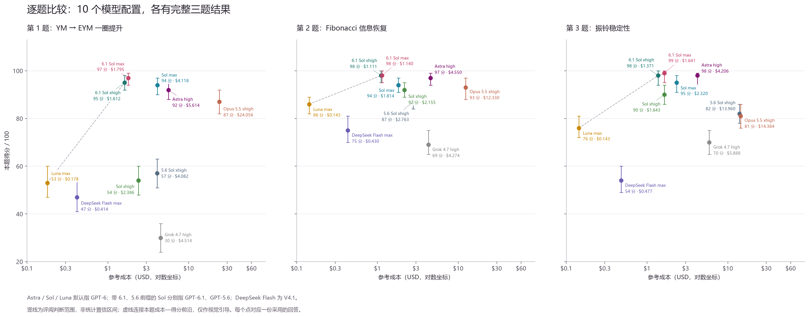
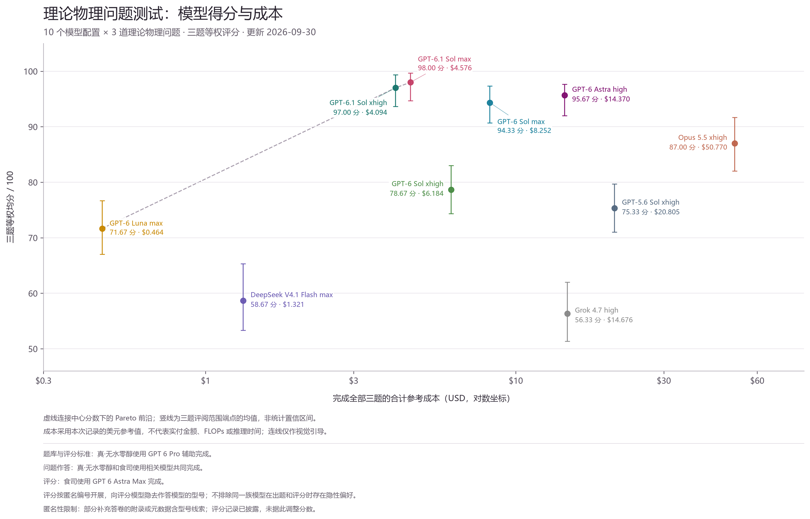
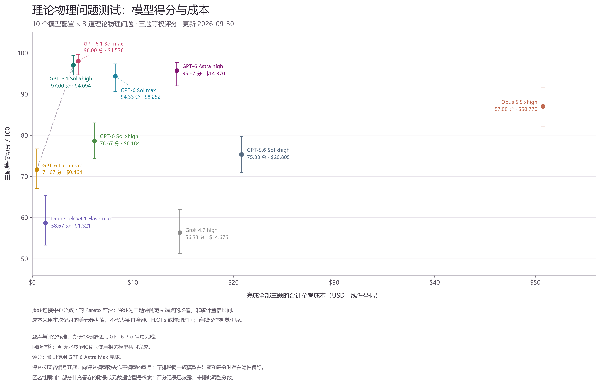
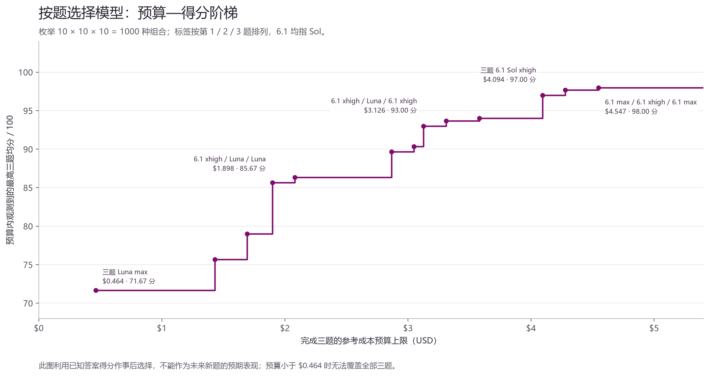

# 理论物理 LLM 测试：完整三题分析

更新日期：2026-09-30。本次采用 10 个模型配置、30 份回答，每题 100 分，三题等权。新增 GPT-6.1 Sol xhigh 与 GPT-6.1 Sol max 的六份回答沿用身份与费用正式披露前已完成的分项评分，不因型号、价格或排名需要调整。原有八个配置的采用分数和费用保持一致。

本次中心分数下，GPT-6.1 Sol max 以 294/300 分、4.576 USD 排名第一；GPT-6.1 Sol xhigh 以 291/300 分、4.094 USD 排名第二。两者相对原有高分配置均取得更高的三题总分和更低的记录成本。统一配置的成本—得分前沿由 GPT-6 Luna max、GPT-6.1 Sol xhigh、GPT-6.1 Sol max 构成。小分差应与具体证明、评阅范围及本次测试条件一起理解。

项目由食司（Manontel）与真·无水零醇共同完成。题库与评分标准由真·无水零醇使用 GPT 6 Pro 辅助完成，问题由真·无水零醇和食司使用相关模型共同作答，评分由食司使用 GPT 6 Astra Max 完成。评分按匿名编号开展；部分补充 PDF 的附录或元数据含身份线索，具体暴露范围已在评阅记录中披露。未据这些线索调整成绩，同族模型在出题和评分中的隐性偏好仍不能排除。

**本轮身份与费用入库。** a 对应 GPT-6.1 Sol xhigh，b 对应 GPT-6.1 Sol max；金额是参与者提供的美元消耗。未提供 token 数，不能据此倒推统一 token 用量、推理时长或 FLOPs。

| 模型配置 | 题 1 编号／分数／USD | 题 2 编号／分数／USD | 题 3 编号／分数／USD | 总分 /300 | 总成本 USD |
| --- | --- | --- | --- | --- | --- |
| GPT-6.1 Sol max | s2_1b ／ 97 ／ 1.795 | s2_2b ／ 98 ／ 1.140 | s2_3b ／ 99 ／ 1.641 | 294 | 4.576 |
| GPT-6.1 Sol xhigh | s2_1a ／ 95 ／ 1.612 | s2_2a ／ 98 ／ 1.111 | s2_3a ／ 98 ／ 1.371 | 291 | 4.094 |

**第 1 题：YM → EYM 一圈提升。** 核心是允许的一次局域标量核是否存在，必须使用正确的树级与一圈输入，并检查整个仿射核空间。

| 排名 | 模型配置 | 分数 | 评阅范围 | 成本 USD | 核心评语 |
| --- | --- | --- | --- | --- | --- |
| 1 | GPT-6.1 Sol max | 97 | 94–99 | 1.795 | 四行精确证书排除完整 n=3 核类；固定三角块的一维全正扩张及 n=4 MHV 校准均成立。 |
| 2 | GPT-6.1 Sol xhigh | 95 | 92–98 | 1.612 | 完整 n=3 核类不可解性成立；D 维积分定位具体，扩张尚未写成明确统一的共线修正关系。 |
| 3 | GPT-6 Sol max | 94 | 90–97 | 4.118 | 完整树零空间及逐排序的树—单负一圈解析证书成立，结论范围准确。 |
| 4 | GPT-6 Astra high | 92 | 88–95 | 5.614 | 完整一圈核类的解析不可解性证书成立；一处输入公式笔误未进入后续主要结果。 |
| 5 | Opus 5.5 xhigh | 87 | 82–92 | 24.056 | n=3符号左零向量证书正确，软留数归约和圈动量插入有价值；数值重构与一般化仍需补证。 |
| 6 | GPT-5.6 Sol xhigh | 57 | 51–63 | 4.082 | 正确的一圈输入和齐次零空间有价值；树级仿射目标错误，另有单负公式及校验矛盾。 |
| 7 | GPT-6 Sol xhigh | 54 | 48–60 | 2.386 | 树和全正校准正确；早期文献单负错号传播至缺陷及主子式证书。 |
| 8 | GPT-6 Luna max | 53 | 47–60 | 0.178 | 树级与全正缺陷正确；单负错号传入12/13主证书，正确输入下所用子系统秩为9/9。 |
| 9 | DeepSeek V4.1 Flash max | 47 | 41–55 | 0.414 | 树零空间和部分低点输入成立；单负错号、缺陷表、全正修复及最小扩张论证均存在实质问题。 |
| 10 | Grok 4.7 high | 30 | 24–36 | 4.514 | 同一核树级已不存在的核心结论源于跨helicity符号匹配失败；未完成一圈结果。 |

GPT-6.1 Sol max 得到 97 分，GPT-6.1 Sol xhigh 得到 95 分。两者都给出有效的 $n=3$ 全允许核类不可解性证书，保留树级八维自由度，扩展线性系统的秩／增广秩为 $9/10$。xhigh 的精确余量 $X(1-2X)$ 在 $X=x(1-x)$、$0<x<1$ 下不为零，且给出可核验的 $D$ 维积分基计算。max 在四行左零证书之外，还给出指定代表、全正扇区中系数明确的一维三角积分修正，并通过一般运动学的 $n=4$ 树级 MHV 校准；这些实质推进构成两分差的主要依据。单负扇区的统一修正和一般点数闭合仍是开放步骤，97 分不表示完成了全部研究层。

GPT-6 Sol max 的 94 分与 GPT-6 Astra high 的 92 分仍对应有效的全核类排除证书。前者的树级—单负一圈恒等式覆盖完整允许核类；后者正文一处输入书写错误没有进入最终证书。Opus 5.5 xhigh 的 87 分有低点符号左零证书、圈动量插入及软归约，主要缺口在重构认证和推广范围。

GPT-5.6 Sol xhigh、GPT-6 Sol xhigh、GPT-6 Luna max 和 DeepSeek V4.1 Flash max 各有正确局部计算，但树级目标错配或一圈单负输入的相对符号影响了核心证明。对错误输入作正确消元不能证明原问题。Grok 4.7 high 的树级否定受 helicity 相位匹配错误影响。新增模型的优势体现在核心证书成立、扩张项定义具体及结论范围准确。

本题前沿为 Luna max → 6.1 Sol xhigh → 6.1 Sol max。6.1 max 相对 xhigh 多花 0.183 USD、多得 2 分；相对旧 GPT-6 Sol max 少花 2.323 USD、多得 3 分。后续科研工作应固定全正修正系数，独立检验单负扇区所需的新积分结构。

该题十份采用回答的平均分为 70.60，最高与最低相差 67 分。

**第 2 题：Fibonacci 信息恢复。** 精确 Stiefel 二阶量、扇区标签泄漏、合法 CPTP decoder 与最优恢复窗口分别计分；Page 型熵校准本身不能替代恢复定理。

| 排名 | 模型配置 | 分数 | 评阅范围 | 成本 USD | 核心评语 |
| --- | --- | --- | --- | --- | --- |
| 1 | GPT-6.1 Sol xhigh | 98 | 95–100 | 1.111 | 精确熵和 Stiefel/标签矩完整；以部分迹算符范数浓缩及 fidelity 切平面证明所有两侧增长、k→∞、有限 Xi 序列的最优 MP 极限，并给出全域单变量普适性反例。 |
| 1 | GPT-6.1 Sol max | 98 | 95–100 | 1.140 | 精确熵、Stiefel/标签矩、Petz与对偶归一化完整；得到固定k Petz精确窗口极限及严格平均converse，在 n_a/k²→0 子类证明最优MP公式，并严格反驳全题面单变量普适性。 |
| 3 | GPT-6 Astra high | 97 | 94–99 | 4.550 | 本组最强的已证窗口结果：MP 下界、每个有限 t 的严格 converse、高保真端同阶误差律，并处理 k=D 边界。 |
| 4 | GPT-6 Sol max | 94 | 91–97 | 1.814 | 给出正确的有限维 Gaussian 谱概率上界、增长 k 的同尺度两侧界，以及非平凡 Jacobi 最优恢复反例。 |
| 5 | Opus 5.5 xhigh | 93 | 88–97 | 12.330 | 完整精确校准与扇区 Haar 随机过滤器归约；碰撞/MP 下界和谱上界实质性强，但唯一极限、精确转折点和总荷推广有过度表述。 |
| 6 | GPT-6 Sol xhigh | 92 | 89–95 | 2.155 | 以 elementary purity/trace-norm 上界完成两侧临界缩放，并给最小镜像切分的精确熵分布反例。 |
| 7 | GPT-5.6 Sol xhigh | 87 | 84–90 | 2.763 | 完整精确校准、正确 Stiefel/标签矩、合法恢复下界；固定 k 的 monogamy converse 给同尺度约束，增长 k 的 converse 尚缺。 |
| 8 | GPT-6 Luna max | 86 | 82–89 | 0.143 | 校准、保真度范数关系与标签泄漏均扎实，且精确求解 classical decoder；研究层只完成高保真一侧。 |
| 9 | DeepSeek V4.1 Flash max | 75 | 70–81 | 0.430 | 精确Stiefel矩与Petz/CPTP优化有效，窗口主要有数值支持；平均约化态、Gaussian归一化、HS阈值及独立列数值对照存在具体错误。 |
| 10 | Grok 4.7 high | 69 | 65–75 | 4.274 | 精确 Stiefel 与高保真充分界正确，但把恒定输出纠缠保真度写成 1/k 并传播到低端表格和结论。 |

GPT-6.1 Sol xhigh 与 GPT-6.1 Sol max 均为 98 分，保留并列。xhigh 对所有满足两侧尺寸及 $k$ 增长、临界变量 $\Xi\to\xi$ 的允许整数序列，证明最优恢复趋向 $g(\varphi^{-\xi})^2$，其中 $g$ 是 MP 谱的平方根矩。关键是部分迹的算符范数集中与根保真度的凹切平面上界相合；这一路线不需额外的 $n_a/k^2\to0$ 条件。max 对固定 $k$ 给出更具体的 Petz 极限、显式恢复对偶界及较完整的 SDP 数值报告；其增长 $k$ 的精确最优公式限定在 $n_a/k^2\to0$ 子类。两份也都给出相同 $\Xi$ 对应不同恢复极限的严格反例，说明全参数域不能只靠一个窗口变量刻画。

两者共同未闭合的是固定 $k=2$ 的唯一最优窗口函数。xhigh 在增长序列范围上更强，max 在固定 $k$ 的界和数值优化证据上更细，现有评分维度没有足够依据稳定地分出先后，故不人为添加小数。

GPT-6 Astra high 的 97 分仍有严格有限窗口 converse、MP 型下界与按规定极限次序成立的高保真同阶律；GPT-6 Sol max 的 94 分有 Gaussian 谱概率上界、增长码维数的双侧界和精确 Jacobi 最优恢复例子。Opus 的 93 分突出在扇区 Haar 过滤器归约，但集中性本身不保证均值极限存在。GPT-6 Sol xhigh 的 92 分保留可靠二阶量、trace norm 控制与镜像例子；GPT-5.6 Sol xhigh 的 87 分有精确矩和合法恢复下界，增长 $k$ 反向界尚未闭合。

GPT-6 Luna max 以 0.143 USD 得到 86 分，精确 classical decoder 和标签泄漏计算提供本题突出的低费用局部成果。DeepSeek 的 75 分受熵平均、独立列模型和阈值推广问题影响；Grok 的 69 分受到把常输出纠缠保真度基线 $1/k^2$ 写成 $1/k$ 的影响。本题前沿只有 Luna max 与 6.1 Sol xhigh；6.1 max 同分且多花 0.029 USD。这个差额很小，只支持本次记录下的成本比较。

该题十份采用回答的平均分为 88.90，最高与最低相差 29 分。

**第 3 题：振铃与谱稳定性。** 固定时间或对数时间窗的估计，与对位置和全部观测时间统一的波形界是不同成果；复频迁移也不能直接替代绝对波形误差的控制。

| 排名 | 模型配置 | 分数 | 评阅范围 | 成本 USD | 核心评语 |
| --- | --- | --- | --- | --- | --- |
| 1 | GPT-6.1 Sol max | 99 | 95–100 | 1.641 | 对实频反射差作完整两区估计：超低频用 accretive 逆，其他区域用短区间传输与通量，保留 l=2 透射权重，证明最优统一 O(ε) 界及统一 O(ε²) 首阶余项。 |
| 2 | GPT-6 Astra high | 98 | 94–99 | 4.206 | 以精确零能解、背景 Green 界及低频通量控制闭合 Q3c 的 α=1/2；最优 Lipschitz 指数仍明确留下超低频面积问题。 |
| 2 | GPT-6.1 Sol xhigh | 98 | 94–100 | 1.371 | 以外侧源的视界能量通量观测界和未扰动背景的去传播相位 H1 估计，闭合全 L、全 T 的最优线性稳定性；因果、双重极限与 mismatch 均正确。 |
| 4 | GPT-6 Sol max | 95 | 91–98 | 2.320 | 通过精确实轴散射关系与通量不等式证明 Q3c；初等 α=1/50，使用适用的背景低能估计提升到 α=1/10。 |
| 5 | GPT-6 Sol xhigh | 90 | 86–94 | 1.643 | 原模型精确 Jost 匹配与临界/超临界重求根较完整，受控对数窗口覆盖回波后时间；Q3c 明确保留为实频积分问题。 |
| 6 | GPT-5.6 Sol xhigh | 82 | 78–86 | 13.960 | 因果、局部共振微扰和受控对数时间窗可靠；全时间 Q3c 未闭合，新腔分支的原模型匹配误差仍不足。 |
| 7 | Opus 5.5 xhigh | 81 | 76–86 | 14.384 | 精确背景Jost与源—探测器代数、显式能量窗和多方法数值较强；全L的α=1仍为猜想，低频分母、条件量词和最优性标签有实质问题。 |
| 8 | GPT-6 Luna max | 76 | 72–81 | 0.143 | 有限时 Volterra、因果窗和 mismatch 正确，低频统一缺口定位清晰；首回波后一致迹估计及复频匹配证明较简略。 |
| 9 | Grok 4.7 high | 70 | 65–75 | 5.888 | 显式位置一致有限时间能量界成立，数值校准有内容；遗漏 L 倍微扰参数，Lipschitz 等价判据少了 ε 缩放，分母无限尾部未解析闭合。 |
| 10 | DeepSeek V4.1 Flash max | 54 | 49–60 | 0.477 | 正确因果与固定L共振首阶、精确delta模型有价值；mismatch公式、临界极限和resolvent对象存在错误，统一能量—流量闭合缺失，最优全时间定理未证明。 |

GPT-6.1 Sol xhigh 的 98 分和 GPT-6.1 Sol max 的 99 分都建立在最佳统一指数 $\alpha=1$ 的证明上。对题给正势、固定宽度、固定源与观察者，两份均证明对所有允许的 $L,T$ 有 $\mathcal E_{\varepsilon,L}(T)\le C\varepsilon$，并用固定位置的非零首阶响应排除更高幂次。这个结论比旧答卷只控制有限时间窗，或给出较弱但合法的全时间幂次，推进得更远。

xhigh 结合扰动系统的外侧通量观测界与背景的移动时间窗估计；max 对完整实频反射差分区控制，并进一步给出对所有位置一致的全时间 $O(\varepsilon^2)$ 一阶展开余项。max 的独立验证项为 14 分，xhigh 为 13 分；这一分主要对应正文实际展示的复频求根、不同数值方法和低频检验覆盖。两者研究推进均为 30/30。

GPT-6 Astra high 也为 98 分，但其已证统一上界是 $C\sqrt{\varepsilon}$，最佳指数区间为 $[1/2,1]$。它与 6.1 xhigh 的同分不表示定理强度相同：xhigh 的研究推进多 1 分，Astra 的独立验证多 1 分，五维加总相抵。GPT-6 Sol max 的 95 分对应已闭合的 $C\varepsilon^{1/10}$ 统一界及较弱替代证明，最佳指数仍留有距离。

GPT-6 Sol xhigh 的 90 分在受控对数窗口内给出有效误差界；GPT-5.6 Sol xhigh 的 82 分有因果链和有限窗结果，低频及新分支控制不足。Opus 的 81 分有精确 Jost 代数与数值核验，但固定 $L$ 的首阶响应不能单独证明全位置 Lipschitz 上界，且超低频分母存在实质问题。Luna 的 76 分保留有限窗与 mismatch 的正确部分；Grok 的 70 分和 DeepSeek 的 54 分仍受统一微扰／通量控制缺口限制。

本题前沿为 Luna max → 6.1 Sol xhigh → 6.1 Sol max。6.1 xhigh 与 Astra 中心分数相同，费用从 4.206 USD 降至 1.371 USD；6.1 max 再多花 0.270 USD、多得 1 分。后续可以集中检查最佳指数定理的常数依赖和完整原始数值材料。

该题十份采用回答的平均分为 84.30，最高与最低相差 45 分。

**三题综合结果与逐模型评价。** 表格按等权总分排序；最低单题分数显示均分之外的短板。

| 排名 | 模型配置 | 题 1 | 题 2 | 题 3 | 总分 /300 | 均分 /100 | 总成本 USD | 最低单题 |
| --- | --- | --- | --- | --- | --- | --- | --- | --- |
| 1 | GPT-6.1 Sol max | 97 | 98 | 99 | 294 | 98.00 | 4.576 | 97 |
| 2 | GPT-6.1 Sol xhigh | 95 | 98 | 98 | 291 | 97.00 | 4.094 | 95 |
| 3 | GPT-6 Astra high | 92 | 97 | 98 | 287 | 95.67 | 14.370 | 92 |
| 4 | GPT-6 Sol max | 94 | 94 | 95 | 283 | 94.33 | 8.252 | 94 |
| 5 | Opus 5.5 xhigh | 87 | 93 | 81 | 261 | 87.00 | 50.770 | 81 |
| 6 | GPT-6 Sol xhigh | 54 | 92 | 90 | 236 | 78.67 | 6.184 | 54 |
| 7 | GPT-5.6 Sol xhigh | 57 | 87 | 82 | 226 | 75.33 | 20.805 | 57 |
| 8 | GPT-6 Luna max | 53 | 86 | 76 | 215 | 71.67 | 0.464 | 53 |
| 9 | DeepSeek V4.1 Flash max | 47 | 75 | 54 | 176 | 58.67 | 1.321 | 47 |
| 10 | Grok 4.7 high | 30 | 69 | 70 | 169 | 56.33 | 14.676 | 30 |

**GPT-6.1 Sol max。** 三题 97, 98, 99，均分 98.00，总成本 4.576 USD。本次得分最高的配置。第 1 题有有效 no-go、系数明确的受限修正与额外校准；第 2 题固定码维数的恢复界和数值优化更具体；第 3 题闭合最佳统一幂次并给出二阶余项。定义、基础校准、结论校准三维均满分，研究推进均值 29.33/30。余下不足主要是未随 PDF 交付的运行附件，以及第 1、2 题仍开放的一般化或精确窗口问题。相对 xhigh 的 1 分均分优势不足以推出跨任务稳定优势。

**GPT-6.1 Sol xhigh。** 三题 95, 98, 98，均分 97.00，总成本 4.094 USD。本次高分与成本折中最突出的配置。三题至少 95 分，较旧 GPT-6 Sol max 总分高 8、成本低 50.4%；较 Astra high 总分高 4、成本低 71.5%。第 2 题的最优 MP 极限覆盖比同代 max 更广的增长序列，第 3 题也完成最佳指数。第 1 题明确修正关系与额外高点校准少于 max，验证附件仍需补齐。它比 max 少花 0.482 USD、少 3 个总分，是本次约 4 USD 总预算下有充分证据支持的完整配置。

**GPT-6 Astra high。** 三题 92, 97, 98，均分 95.67，总成本 14.370 USD。全核排除、严格恢复 converse 和全时间稳定性仍有价值，独立验证均值 13.67/15，与 6.1 max 相同。新的 xhigh 三题分数分别比它高 3、高 1、持平，每题成本均更低，因此在本次成本—中心分数比较中被支配。第 3 题同分时仍应注意证明幂次的区别。其既有解答可作为独立证明路线，离开成本前沿不影响原结果的有效性。

**GPT-6 Sol max。** 三题 94, 94, 95，均分 94.33，总成本 8.252 USD。三题跨题分差仅 1，仍是本组分数波动最小的配置。有效排除证书、合法恢复界和完整统一稳定性证明说明表现可靠，结论校准三题均满分。两个 6.1 配置在每道题均取得更高中心分数且费用更低，原有价格优势在新增样本中被取代。单次三题的低波动不能直接估计真实运行方差。

**Opus 5.5 xhigh。** 三题 87, 93, 81，均分 87.00，总成本 50.770 USD。低点证书、扇区 Haar 归约与 Jost 代数有实质内容，研究推进均值 25.67/30。短板集中在数值或条件估计到精确、统一、最优结论之间的证明跨度，结论校准均值 6.33/10。三题成本为本组最高，两个 6.1 配置和旧 Sol max 均逐题更便宜且得分更高。报告中的正确引理值得保留，更强的概括性结论应单独核验。

**GPT-6 Sol xhigh。** 三题 54, 92, 90，均分 78.67，总成本 6.184 USD。第 2、3 题达到 92、90 分，但第 1 题为 54，反映错误物理输入可使完整代数证书失去针对性。三题差异明显，整体费用已高于两个新 6.1 配置；6.1 xhigh 在每题均更高分且更便宜。后续评测值得检查能否通过独立输入校准消除第 1 题这类失败。

**GPT-5.6 Sol xhigh。** 三题 57, 87, 82，均分 75.33，总成本 20.805 USD。精确矩、合法恢复下界和因果有限窗结果值得保留，树级目标错配、增长维数反向界和全时间低频控制限制了结论。费用中第 3 题占 13.960 USD；本次未表现出相对新旧高分 Sol 配置的质量—成本优势。较长推导或较高消耗不能替代对核心结论的检验。

**GPT-6 Luna max。** 三题 53, 86, 76，均分 71.67，总成本 0.464 USD。保留最低成本完整配置的位置。第 2 题的精确校准、标签泄漏和 decoder 成果达到 86 分，展示低预算可完成的局部步骤；第 1 题核心证书仍失效，第 3 题统一研究层未闭合。总分/USD 最高不意味着可替代完整核心证明。它在三题上均比 DeepSeek Flash 和 Grok 更便宜、分数更高，低预算端的相对优势仍然保留。

**DeepSeek V4.1 Flash max。** 三题 47, 75, 54，均分 58.67，总成本 1.321 USD。记录成本较低，树零空间、Stiefel/Petz 框架和因果结构提供部分正确内容；关键输入错误及从局部结果到统一结论的跳跃限制了可信度。研究推进均值 11.67/30、结论校准 4.00/10。Luna 三题总分高 39、费用少 0.857 USD，逐题优势均成立，因此本次没有相对 Luna 的选型优势。

**Grok 4.7 high。** 三题 30, 69, 70，均分 56.33，总成本 14.676 USD。本次综合分最低。随机等距框架、有限时间能量界和若干数值计算正确，但树级相位、纠缠保真度基线与长时微扰参数问题影响主要结论。总成本高于多种得分更高的完整配置；Luna 也逐题更便宜且更高分。后续应优先修复基础校准。

**成本—得分曲线。** 横轴是完成全部三题的美元记录成本，纵轴是三题等权均分；对数和线性版本使用同一组数据。虚线连接本次中心分数下的离散 Pareto 前沿，不拟合连续算力缩放律。一个配置被支配，表示存在另一个配置成本不高、得分不低，并且至少一项严格更好。

| 前沿配置 | 总分 /300 | 均分 /100 | 总成本 USD | 均分评阅范围 |
| --- | --- | --- | --- | --- |
| GPT-6 Luna max | 215 | 71.67 | 0.464 | 67.00–76.67 |
| GPT-6.1 Sol xhigh | 291 | 97.00 | 4.094 | 93.67–99.33 |
| GPT-6.1 Sol max | 294 | 98.00 | 4.576 | 94.67–99.67 |

Luna 到 6.1 xhigh 增加 3.630 USD、增加 76 个总分；6.1 xhigh 到 6.1 max 增加 0.482 USD、增加 3 个总分。后一段意味着记录费用提高 11.8%，均分从 97 提高到 98。分数接近量表上限，边际分数既受真实证明差异影响，也受评分量表分辨率和天花板影响，不能从三个离散点推出一般的收益递减规律。

| 完整配置比较 | 总分变化 | 均分变化 | 成本变化 USD | 成本变化率 |
| --- | --- | --- | --- | --- |
| 6.1 max 相对 6.1 xhigh | 3 | 1.00 | +0.482 | +11.8% |
| 6.1 xhigh 相对 6 Sol max | 8 | 2.67 | -4.158 | -50.4% |
| 6.1 max 相对 6 Sol max | 11 | 3.67 | -3.676 | -44.5% |
| 6.1 xhigh 相对 Astra high | 4 | 1.33 | -10.276 | -71.5% |
| 6.1 max 相对 Astra high | 7 | 2.33 | -9.794 | -68.2% |

两个 6.1 配置都在逐题中心分数和逐题成本上支配 Astra high、旧 GPT-6 Sol max、旧 GPT-6 Sol xhigh、GPT-5.6 Sol xhigh、Opus 和 Grok。DeepSeek 的总成本低于 6.1，离开前沿的直接原因是更便宜且更高分的 Luna。这次增量主要改变约 4 USD 及以上的高质量选择，最低预算端仍是 Luna。

总分/USD 在 Luna、6.1 xhigh、6.1 max 上分别为 463.36、71.08、64.25，只作辅助读数。评分没有比例尺度意义，不能把这些比值解释为科研价值倍数，也不能因为费用高就推断使用了更多实际算力。缺少统一 token、延迟或硬件数据时，只讨论记录成本与证据评分。

权重敏感性方面，6.1 max 相对 xhigh 的逐题分差为 $(2,0,1)$。任意非负权重 $w_1+w_2+w_3=1$ 下，加权分差为 $2w_1+w_3\ge0$；只有全部权重放在第 2 题时两者同分。因此 max 的中心分数第一不依赖等权选择。xhigh 相对 Astra 的分差为 $(3,1,0)$，也在任意非负题目权重下保持不低分。这个事实说明当前三题内部的权重稳健性，不解决题目抽样、重复运行和评分误差的外推限制。

**允许按题选择时的预算分析。** 枚举 10 × 10 × 10 = 1000 种组合。以下最低成本约束基于已知成绩作事后选择，尚未在未知题上验证。表内使用完整模型名。

| 选择标准 | 第 1 题 | 第 2 题 | 第 3 题 | 得分向量 | 三题均分 | 总成本 USD |
| --- | --- | --- | --- | --- | --- | --- |
| 三题均用 Luna max | GPT-6 Luna max | GPT-6 Luna max | GPT-6 Luna max | 53/86/76 | 71.67 | 0.464 |
| 每题至少 75 分：最低成本 | GPT-6.1 Sol xhigh | GPT-6 Luna max | GPT-6 Luna max | 95/86/76 | 85.67 | 1.898 |
| 每题至少 80 分：最低成本 | GPT-6.1 Sol xhigh | GPT-6 Luna max | GPT-6.1 Sol xhigh | 95/86/98 | 93.00 | 3.126 |
| 每题至少 90 分：最低成本 | GPT-6.1 Sol xhigh | GPT-6.1 Sol xhigh | GPT-6.1 Sol xhigh | 95/98/98 | 97.00 | 4.094 |
| 每题至少 95 分：最低成本 | GPT-6.1 Sol xhigh | GPT-6.1 Sol xhigh | GPT-6.1 Sol xhigh | 95/98/98 | 97.00 | 4.094 |
| 三题均用 6.1 Sol xhigh | GPT-6.1 Sol xhigh | GPT-6.1 Sol xhigh | GPT-6.1 Sol xhigh | 95/98/98 | 97.00 | 4.094 |
| 三题均用 6.1 Sol max | GPT-6.1 Sol max | GPT-6.1 Sol max | GPT-6.1 Sol max | 97/98/99 | 98.00 | 4.576 |
| 逐题最高分：最低成本 | GPT-6.1 Sol max | GPT-6.1 Sol xhigh | GPT-6.1 Sol max | 97/98/99 | 98.00 | 4.547 |

1.898 USD 的 6.1 xhigh / Luna / Luna 组合得到 95、86、76，均分 85.67；3.126 USD 的 6.1 xhigh / Luna / 6.1 xhigh 得到 95、86、98，均分 93。要求每题至少 90 分，最低成本是全部使用 6.1 xhigh，4.094 USD 得到 95、98、98，也同时满足每题至少 95 分。达到三题均分 90 的最低成本组合为 6.1 max / 6.1 xhigh / Luna，3.049 USD、97/98/76、均分 90.33。均分门槛和最低单题门槛应分开看待。

逐题最高中心分数的最低成本组合为 6.1 max / 6.1 xhigh / 6.1 max，4.547 USD、97/98/99、均分 98。第 2 题用 xhigh 代替 max 保持 98 分、节省 0.029 USD，较全用 max 节省约 0.6%。这个差额很小，意义主要是核对同分时的选择逻辑。4.277 USD 的 max / xhigh / xhigh 组合则以 293/300 分处于二者之间。

**评分与数据使用范围。** 五维量表沿用定义与题设审计 15、已知／低阶校准 30、独立验证 15、研究推进 30、结论校准与可继续性 10。评阅者新增的解析、符号和数值检查只用于检验答卷，不反计为作答模型自行完成的工作。新答卷引用的部分源码、原始输出和日志未随 PDF 提交，已体现在验证维度；不能把未交附件直接认定为虚构。

6.1 max 与 xhigh 的三题均分评阅范围分别为 94.67–99.67、93.67–99.33；Astra 为 92.00–97.67，旧 Sol max 为 90.67–97.33。这些范围是逐题评阅上下限的算术均值，表示复评可能的判断变化，不是统计置信区间，也不是已建模的概率分布。上位配置范围明显重叠，中心分数排序不能转化为精确胜率或显著性结论。

每个配置每题只有一份采用回答，三道题也不是所有理论物理问题的随机样本。交互轮次、工具权限、上下文和修正机会没有充分证据证明严格一致。Opus 使用此前指定的格式统一补充版本，费用沿用原记录且各计一次；未单列的额外整理费用不另行估计。新模型的三题 a 答卷正文出现费率型号文字，评分时记录了暴露并排除费用附录；第一轮补充还保留辅助评阅接触元数据线索的说明。应保留这些过程差异，不能声称严格无身份线索的双盲实验。

30 项采用结果的参考成本合计 125.512 USD；本轮六项新增 8.670 USD，其中 xhigh 为 4.094 USD，max 为 4.576 USD。工作簿保留 Task 1、Task 2、Task 3 与综合汇总四个 sheet，公式、四个原生散点图和 30 项分项明细同步更新。原生图横坐标使用本次成本快照，改动费用后需重新生成；PNG/SVG 展示完整评阅范围，保留点旁小字号标签、项目署名及匿名评分说明。

分数和科学结论的具体依据见：[评分细则](../questions/math_physics_ai_benchmark_rubric.md)；[本轮费用与身份记录](../costs/supplement_2nd_costs.json)；[原批次第 1 题评阅](../evaluations/original/q1_assessment.md)；[原批次第 2 题评阅](../evaluations/original/q2_assessment.md)；[原批次第 3 题评阅](../evaluations/original/q3_assessment.md)；[第一轮补充第 1 题评阅](../evaluations/supplement/q1_assessment.md)；[第一轮补充第 2 题评阅](../evaluations/supplement/q2_assessment.md)；[第一轮补充第 3 题评阅](../evaluations/supplement/q3_assessment.md)；[第二轮补充第 1 题评阅](../evaluations/supplement_2nd/q1_assessment.md)；[第二轮补充第 2 题评阅](../evaluations/supplement_2nd/q2_assessment.md)；[第二轮补充第 3 题评阅](../evaluations/supplement_2nd/q3_assessment.md)。
